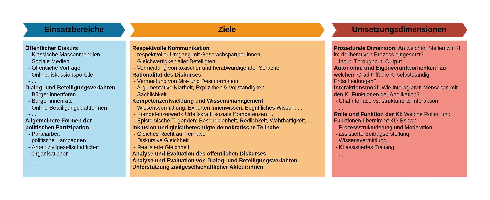
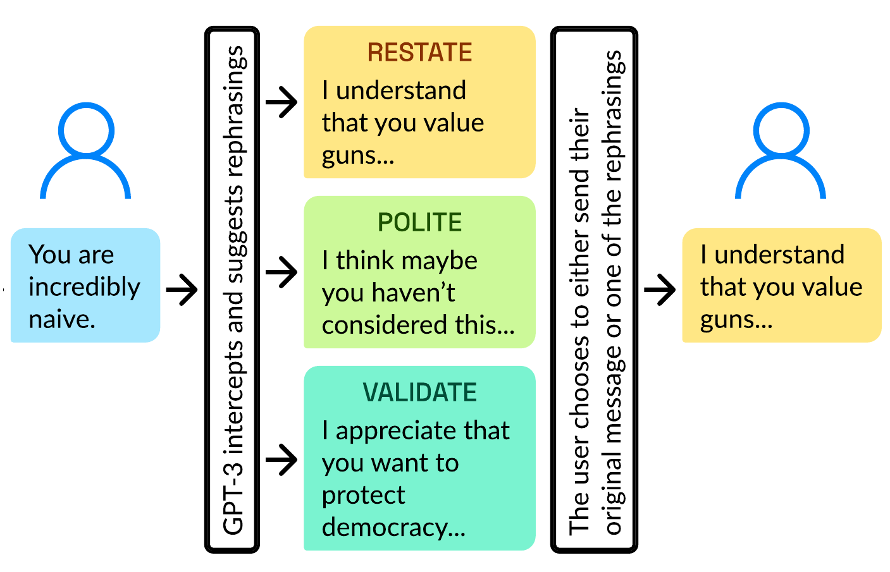
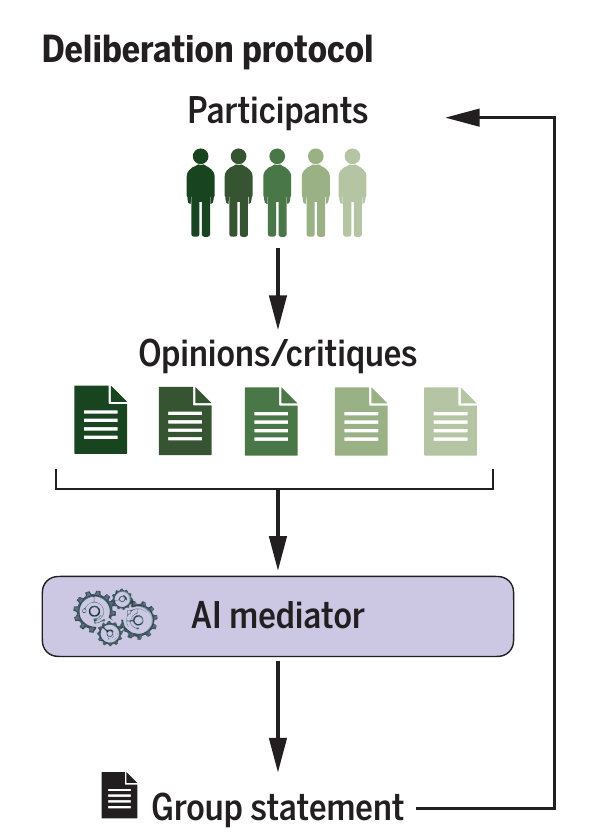

# Einsatzszenarien von KI zur Stärkung deliberativer Kultur {#sec-szenarien}

Wie können Sprachmodelle eingesetzt werden, um unsere deliberative Kultur zu stärken, und welche Einsatzszenarien sind hierfür besonders vielversprechend? Im Folgenden werden einige Szenarien skizziert, ohne Anspruch auf Vollständigkeit zu erheben. Die Beispiele sollen vielmehr das Spektrum der vielfältigen Möglichkeiten zur Stärkung deliberativer Kultur durch KI aufzeigen.

Die Einsatzszenarien lassen sich dabei anhand der folgenden drei Dimensionen charakterisieren (siehe @fig-einsatzszenarien):

1. **Einsatzbereich:** In welchen deliberativen Kontexten wird KI eingesetzt?
2. **Ziele:** Welche Ziele sollen durch den Einsatz von KI in diesem Einsatzbereich erreicht werden, um deliberative Kultur zu stärken?
3. **Umsetzung & Funktion:** Wie soll KI konkret genutzt werden, um diese Ziele zu erreichen?

{#fig-einsatzszenarien}

## Einsatzbereiche

Um die relevanten Einsatzbereiche -- also die deliberativen Kontexte -- näher zu bestimmen, muss geklärt, was mit Deliberation eigentlich gemeint ist. Obwohl in den Politikwissenschaften um die Details einer adäquaten Erläuterung des Deliberationsbegriffs gerungen wird,^[Einen Überblick geben @neblo_family_2011 und @bachtiger_disentangling_2010.] lässt sich ein unproblematischer Kern wie folgt formulieren: In deliberativen Kontexten treffen Menschen in unterschiedlichen öffentlichen Rollen (beispielsweise als Bürger:innen, Politiker:innen oder Interessenvertreter:innen) zusammen, um Anliegen des öffentlichen Lebens zu diskutieren und gegebenenfalls zu entscheiden. Dabei werden unterschiedliche Ansichten ausgetauscht und im Lichte von Informationen, Gründen und Einwänden angepasst, um bestenfalls zu einer gut begründeten Entscheidung zu gelangen.

Deliberation unterscheidet sich deutlich von anderen Interaktionsformen: Der Austausch persönlicher Erlebnisse ohne Bezug zu öffentlichen Anliegen stellt keine Deliberation im hier verwendeten Sinne dar. Zudem wird Deliberation häufig von Verhandlungen oder Mediationen abgegrenzt.^[Zusammenfassend in @goldschmidt_kriterien_2014, S. 69--74.] In Verhandlungen treffen Personen mit gegensätzlichen Interessen und meist asymmetrischen Durchsetzungsmöglichkeiten aufeinander. Verhandlungen zielen auf einen Interessenausgleich ab, der zwar durch Normen reguliert ist, jedoch selten auf einer gleichberechtigten Interaktion basiert. Im Gegensatz dazu wird ideale Deliberation als Austausch von Ansichten, Perspektiven und Argumenten gleichberechtigter Gesprächsteilnehmer:innen verstanden.

Bevor wir mit der Charakterisierung idealtypischer Deliberation bereits auf mögliche Ziele eines KI-Einsatzes zu sprechen kommen, ist die vorläufige Charakterisierung ausreichend, um mögliche Einsatzbereiche, also relevante deliberative Kontexte, näher zu spezifizieren. 

Der **öffentliche und teilöffentliche** Diskurs ist ein zentraler deliberativer Kontext. In sozialen Medien, Onlineforen, auf öffentlichen Vorträgen, in Plenumsdiskussionen und in parlamentarischen Debatten werden Perspektiven, Meinungen, Informationen und Argumente ausgetauscht. Auch wenn klassische Massenmedien kein Forum aktiver Deliberation darstellen, da ihnen die direkte Interaktion zwischen Bürger:innen fehlt, spielen sie für deliberative Kontexte eine zentrale Rolle: Sie spiegeln und prägen den öffentlichen Diskurs, geben Bürger:innen mindestens mittelbar die Möglichkeit, ihre eigene Meinung auszudrücken und informieren sie über soziale, politische und kulturelle Belange des öffentlichen Lebens. 

Auch in vielen **Dialog- und Beteiligungsverfahren** spielt Deliberation eine entscheidende Rolle. Darunter zählen unter anderem Bürgerräte und Konsenskonferenzen.^[Für einen Überblick siehe @nanz_handbuch_2012.] In Bürgerräten kommen in etwa acht bis zwölf zufällig gewählte Bürger:innen über einen Zeitraum von zwei Tagen zusammen, die sich in einem ersten Schritt auf ein gesellschaftsrelevantes Problem als Thema einigen, um dann dieses zu diskutieren. Die vom Bürgerrat erarbeiteten Lösungsansätze werden veröffentlicht und können als Input für die politische Entscheidungsfindung dienen. 

Konsenskonferenzen sind im Vergleich zu Bürgerräten stärker strukturiert und finden über einen Zeitraum von 3 Tagen mit etwa 20 zufällig gewählten Bürger:innen statt. Im Gegensatz zum Bürgerrat wird das Thema vorgegeben, und vor Beginn der eigentlichen Konferenz werden den Teilnehmenden Informationen bereitgestellt. Während der Konferenz haben die Teilnehmenden die Möglichkeit, Expert:innen zu konsultieren und untereinander zu diskutieren. Anschließend erarbeiten sie Stellungnahmen und Empfehlungen, die in Form eines Abschlussberichts veröffentlicht und in der politischen Entscheidungsfindung berücksichtigt werden können.

<!--
#TODO: Vlt. eher noch Online-Beteiligungsverfahren erwähnen?
-->
Dialog- und Beteiligungsverfahren zeichnen sich dadurch aus, dass sie unter bestimmten Zielsetzungen durchgeführt werden und Teilnehmende in ihrer Rolle als Bürger:innen und Laien zu komplexen gesellschaftsrelevanten Themen Stellung nehmen [@goldschmidt_kriterien_2014]. In vielen Formaten spielt der Austausch von Argumenten auf Basis von Informationen und Evidenzen eine zentrale Rolle. Im Gegensatz zu reinen Abstimmungen wird im Rahmen solcher Deliberationen häufig eine gemeinsame Position entwickelt, die nicht unbedingt Konsens voraussetzt, und die dann als Ergebnis des Verfahrens im Idealfall Einfluss auf politische Entscheidungsprozesse hat. 

Neben Dialog- und Beteiligungsverfahren sollen im Folgenden auch **allgemeinere Formen der Partizipation** als relevant erachtet werden, sofern sie mindestens mittelbar für gelingende Deliberation wichtig sind. Darunter zählt insbesondere die **politische Partizipation**, wie z.B. die Mitgliedschaft und Mitarbeit in Parteien, die Arbeit in zivilgesellschaftlichen Organisationen und selbstorganisiertes Bürgerengagement im Demokratiebereich.^[Zum Begriff der *politischen Partizipation* vgl. @woyke_politische_2021.] Deliberation spielt sowohl in der Parteiarbeit als auch in der zivilgesellschaftlichen Arbeit eine zentrale Rolle. So diskutieren Parteimitglieder auf Ständen mit Bürger:innen oder deliberieren parteiintern auf Parteitagen und in Parteibeiräten. Auch zivilgesellschaftliche Organisationen müssen intern Positionen und Strategien entwickeln und zu gesellschaftsrelevanten Themen Stellung nehmen. Darüber hinaus tragen viele zivilgesellschaftliche Organisationen im Demokratiebereich mittelbar zur Stärkung deliberativer Kultur bei, indem sie für deliberative Werte und Normen einstehen und diese fördern.

## Ziele und Umsetzung {#sec-ziele}

Für die Bestimmung der Ziele, die durch den Einsatz von KI zur Stärkung der deliberativen Kultur verfolgt werden können, lohnt sich ein erneuter Blick auf den Deliberationsbegriff. Deliberation ist ein normativer Begriff mit impliziten Gelingensbedingungen. Diese Bedingungen formulieren deliberative Normen, anhand derer die Güte von Deliberation gemessen wird. Wenn von der Stärkung deliberativer Kultur gesprochen wird, geht es also implizit darum, Deliberation so auszurichten, dass sie diesen Normen möglichst gerecht wird. Deliberative Normen wurden prominent von @habermas_theorie_1981 und @cohen_deliberation_2005 formuliert und seitdem in der Politikwissenschaft diskutiert, verfeinert und ergänzt. Die fachwissenschaftliche Debatte um diese Normen ist komplex und verzweigt.^[Für einen Überblick vgl. @neblo_family_2011 und @bachtiger_disentangling_2010] Relativ unproblematisch erscheint es, die von Habermas und Cohen formulierten Normen als regulatives Ideal zu betrachten: Sie formulieren idealtypische Deliberation, die (mit bestimmten Ausnahmen und Bedingungen) als anzustrebende Deliberationsform gilt [@steiner_deliberative_2004]. Im Folgenden sollen diese Normen skizziert und es soll anhand von Beispielen illustriert werden, wie KI eingesetzt werden kann, um Deliberation im Sinne dieser Normen zu stärken.^[Wir folgen dabei lose den in @friess_ai_2025 und @friess_systematic_2015 vorgeschlagenen Kategorisierungen.]

### Respektvolle Kommunikation (*Civility*) {#sec-civility}

Ein respektvoller Umgang verlangt, dass die Bedürfnisse, die Rechte und die prinzipielle Gleichwertigkeit aller Beteiligten anerkannt werden [@friess_ai_2025]. Diese Arten von Anerkennung setzen voraus, dass auf toxische Sprache und damit insbesondere auf herabwürdigende und derogative Rede verzichtet wird. Dazu gehört auch, dass sich Beteiligte aufeinander beziehen und nicht etwa die Beiträge anderer ignorieren.^[Während @friess_ai_2025 gegenseitige Bezugnahme als eine weitere Norm aufführen (*reciprocity*), subsumieren wir diese der Einfachheit halber unter die Norm des respektvollen Umgangs.]

Respektvolle Kommunikation ist eine zentrale Voraussetzung für eine Gesprächsatmosphäre, die einen konstruktiven Umgang trotz divergierender Meinungen ermöglicht. Ohne einen respektvollen Umgang sind Teilnehmende weniger bereit, die Beiträge anderer ernsthaft zu berücksichtigen [@steenbergen_measuring_2003] und gegebenenfalls ihre Überzeugungen im Lichte neuer Informationen und Argumente anzupassen.

Gerade in sozialen Medien fehlt es häufig an Respekt. So berichten in einer repräsentativen Umfrage 2/3 der Befragten zwischen 16 und 24 Jahren, Hass im Netz gesehen zu haben [@brennauer_lauter_2024]. Wie können nun LLMs dazu beitragen, einen respektvollen Umgang in deliberativen Kontexten zu fördern? Eine wichtige Rolle für die KI-gestützte Förderung eines respektvollen Umgangs ist die automatisierte Identifizierung toxischer Sprache. KI-basierte Detektion toxischer Sprache ist schon länger Gegenstand der Forschung.^[Für einen Überblick siehe @schmidt_survey_2017 und @fortuna_survey_2018.]

<!-- Probleme klass. Algorithmen -->
Klassische Machine-Learning-Algorithmen haben allerdings teilweise Schwierigkeiten bei der Erkennung toxischer Sprache aufgrund der Kontextabhängigkeit dieses Phänomens [@guo_investigation_2024]. Ob Äußerungen bezüglich des Kriteriums von Respekt problematisch sind, kann unter anderem davon abhängen, welche kulturellen und sozialen Normen im spezifischen Äußerungskontext gelten, welche Intentionen die Sprecher:innen verfolgen und ob indirekte Rede oder Codewörter (bspw. beim *whistleblowing*) verwendet werden. Schon die Verfügbarkeit geeigneter Trainings- und Testdatensätze ist eine Herausforderung, da die notwendigen Kontextinformationen in den Datensätzen enthalten sein sollten und die Datensätze die Heterogenität und Diversität des Toxizitätsphänomens hinreichend adäquat abbilden sollten.

<!-- Warum Sprachmodelle -->
Sprachmodelle, so die Hoffnung, könnten genutzt werden, um geeignete (synthetische) Datensätze zu erzeugen und um Toxizität akkurat zu identifizieren, wenn ihnen die entsprechenden Kontextinformationen zur Verfügung gestellt werden.^[Vorläufige Einschätzungen geben @albladi_hate_2025, @guo_investigation_2024, @kruk_silent_2024, @pendzel_generative_2023 und @plaza-del-arco_respectful_2023. Im Rahmen des KIdeKU-Projekts haben wir eine explorative Evaluation unseres Toxicity-Detectors durchgeführt. Die Ergebnisse dieser explorativen Evaluation finden sich in @sec-tode-eval.]

<!-- Anwendungen -->
Erfolgt die Detektion toxischer Sprache mittels Sprachmodelle zuverlässig, könnten diese eingesetzt werden, um in sozialen Medien und anderen Onlineplattformen automatisch Beiträge mit herabwürdigender oder derogativer Sprache zu markieren. Darauf aufbauend könnte eine KI-basierte Moderation entsprechende Beiträge kennzeichnen und gegebenenfalls entfernen. Zudem könnten Moderationstools Nutzer:innen sensibilisieren, indem sie schon während der Formulierung problematischer Äußerungen Warnungen ausgeben und alternative Formulierungen vorschlagen.^[Im [IndI-Projekt](https://www.diid.hhu.de/forschung/projekte/indi) wurde zum Beispiel ein KI-basierter Prototyp entwickelt, der Texteingaben bezüglich Respekt, Höflichkeit und Empathie analysiert und gegebenenfalls Reformulierungsvorschläge unterbreitet.] KI-unterstützte Beitragserstellung kann den Umgangston verbessern, ohne Inhalte zu verfälschen, und damit die Bereitschaft fördern, Gegenpositionen ernst zu nehmen [@argyle_leveraging_2023]. Selbst in Kontexten ohne direkte Moderationsmöglichkeiten kann KI zur Eindämmung von Toxizität beitragen, beispielsweise durch LLM-basierte Counterspeech-Bots, die Gegenrede generieren und so die Nutzerinteraktion mit toxischen Beiträgen reduzieren [@saha_zero-shot_2024; @podolak_llm_2024].

::: {.callout-tip}
## Beispiel: KI-gestützte Förderung respektvoller Kommunikation

❓**Fragestellung:** Wie können Sprachmodelle genutzt werden, um einen respektvollen Umgang in politischen Online-Diskussionen zu fördern? In einem Experiment mit 1574 Teilnehmer:innen zum Thema Waffenkontrolle untersuchten @argyle_leveraging_2023, ob KI-basierte Formulierungsassistenten zu einer Verbesserung der gegenseitigen Anerkennung und der wahrgenommenen Qualität von Online-Diskussionen beitragen können. 

🤖 **KI-Ansatz:** Teilnehmer:innen wurden in Paare mit gegensätzlichen Positionen aufgeteilt, die anschließend ihre Ansichten in kurzen Dialogen austauschten. Für die Beitragserstellung durchlief der/die Nutzer:in die folgenden Schritte:

1. Der:die Nutzer:in formuliert einen Diskussionsbeitrag.
2. Das Sprachmodell analysiert den Beitrag und generiert Reformulierungsvorschläge zur Verbesserung von Höflichkeit und Respekt, die den inhaltlichen Standpunkt des Beitrags nicht verändern.
3. Der:die Nutzer:in wählt einen Vorschlag oder behält die ursprüngliche Formulierung bei, bevor der Beitrag sichtbar wird.

{width=70%}

📝 **Ergebnis:** Die Studie ergab, dass die politischen Positionen der Teilnehmer:innen unverändert blieben. Der Einsatz von KI verbesserte jedoch die wahrgenommene Gesprächsqualität und gegenseitige Bezugnahme. Die Autor:innen schließen, dass KI-Tools genutzt werden können, um gegenseitigen Respekt und konstruktiven Dialog in digitalen Räumen zu fördern, ohne Nutzer:innen in ihren Überzeugungen zu manipulieren.

:::

### Rationalität des Diskurses

<!--Allgemeine Beschreibung--> 
Das deliberative Modell stellt den Austausch von Ansichten, Informationen und Argumenten in den Mittelpunkt kollektiver Entscheidungsfindung. Dieser Austausch soll sachlich, konstruktiv und wahrheitsorientiert erfolgen. Deliberation ist rational, insofern Teilnehmende empirische Evidenzen und Fakten berücksichtigen und ihre Überzeugungen im Lichte rationaler Argumente anpassen [@gerber_deliberative_2014]. Gleichzeitig sollten Teilnehmende idealerweise nicht von Faktoren beeinflusst werden, die für die Güte von Argumenten irrelevant sind. Zu solchen Faktoren zählen beispielweise Zwang oder die Dominanz bestimmter Positionen.

<!-- Relevanz --> 
Die Erfüllung dieser Rationalitätsnormen ist insbesondere für die Qualität der Entscheidungsfindung relevant. Auch bei kollektiven Entscheidungen gibt es bessere und schlechtere Entscheidungen, die sich an instrumentellen und allgemein gültigen moralischen Werten messen lassen. Wenn Teilnehmende diesen Rationalitätsnormen gerecht werden, führt das -- so die Idee -- zu besseren Entscheidungen.

<!-- Konkrete Beschreibung & KI Umsetzung --> 
Aber wie können KI-gestützte Anwendungen dazu beitragen, die Rationalität von Diskursen zu fördern? Es gibt verschiedene Möglichkeiten, wie KI in diesem Zusammenhang eingesetzt werden könnte. Zum einen könnten KI-gestützte Tools dazu genutzt werden, um Mis- und Desinformation zu erkennen und zu bekämpfen, indem sie beispielsweise Sachaussagen überprüfen und Quellen bewerten. Zum anderen könnten KI-gestützte Tools eingesetzt werden, um die Qualität von Argumenten zu bewerten und zu verbessern. 

<!-- Vermeidung von Mis- und Desinformation -->
Die Verbreitung von Mis- und Desinformation kann dazu führen, dass Positionen und Entscheidungen auf falschen Aussagen beruhen. Misinformation bezeichnet die unbeabsichtigte Verbreitung falscher Aussagen, verursacht durch Fehlinformationen, Missverständnisse und unzureichende Medienkompetenz, während Desinformation die absichtliche Verbreitung falscher oder irreführender Aussagen zur Täuschung oder Manipulation bezeichnet [@fallis_what_2015]. Desinformation wird insbesondere in sozialen Medien von einer kleinen Anzahl von Akteur:innen verbreitet [@baribi-bartov_supersharers_2024]. In der politischen Kommunikation wird sie häufiger von rechtspopulistischen als von Politiker:innen anderer politischer Richtungen als Mittel gebraucht [@tornberg_when_2025].

Analog zur Identifikation toxischer Sprache existieren zahlreiche KI-basierte Ansätze zur Erkennung von Mis- und Desinformation.^[Einen Überblick liefern @chen_can_2024, @guo_survey_2022, @setty_surprising_2024, @vykopal_generative_2024 und @zhang_towards_2023.] Diese nutzen Methoden wie Textmerkmalsanalyse und Faktenüberprüfung anhand bewerteter Quellen, um die Glaubwürdigkeit von Informationen zu beurteilen. KI-basierte Faktenchecker können in sozialen Medien und anderen Onlineplattformen eingesetzt werden, um die Verbreitung von Mis- und Desinformation zu reduzieren, beispielsweise durch die Markierung irreführender Beiträge oder Warnmeldungen an Nutzer:innen, um das Teilen solcher Inhalte zu verringern. Zudem können diese Tools Nutzer:innen sensibilisieren, indem sie Informationen zu Risiken von Mis- und Desinformation bereitstellen oder alternative Quellen vorschlagen.

<!-- Argument Mining -->
Neben der Bekämpfung von Desinformation durch Faktenchecks können KI-gestützte Tools Bürger:innen bei der Analyse und Evaluation von Argumenten unterstützen. Argument Mining, ein Forschungszweig der Computerlinguistik, zielt darauf ab, Argumente sowie deren Struktur und Zusammenhänge in natürlichsprachlichen Texten zu identifizieren und zu analysieren [@lawrence_argument_2019; @lippi_argumentation_2016]. Mit dem Aufkommen von Sprachmodellen wird verstärkt untersucht, ob diese für solche Aufgaben geeignet sind [@mirzakhmedova_are_2024; @guida_llms_2025]. Sind Argumente und ihre Zusammenhänge erst einmal identifiziert, können sie darauf aufbauend auch evaluiert werden [@wachsmuth_argument_2024]. 

Die Anwendungsfälle von Argument Mining zur Stärkung der Rationalität des Diskurses sind vielfältig. 

Eine notwendige Voraussetzung für konstruktive und sachbezogene Diskursteilnahme ist ein hinreichendes Verständnis der Äußerungen anderer. Teilnehmende müssen erkennen, welche Argumente vorgetragen wurden, in welchen Zusammenhängen sie stehen und welche Schwachstellen sie aufweisen. Andernfalls drohen Missverständnisse, das Übersehen relevanter Argumente und ein Aneinandervorbeireden. Die automatisierte Identifikation von Argumenten durch Argument Mining kann dazu beitragen, dass Teilnehmende leichter erkennen, welche Argumente tatsächlich vorgetragen wurden und welche Äußerungsbestandteile keine argumentative Funktion erfüllen. Dies fördert mittelbar die gegenseitige Bezugnahme sowie die Vermeidung vorschneller thematischer Abschweifungen.

Die automatisierte Generierung von Pro-Kontra-Listen und Argumentkarten ermöglicht es, Teilnehmenden einen strukturierten Überblick über Diskurse zu bieten. Insbesondere in komplexen Debatten eignen sich Argumentkarten, um Zusammenhänge zwischen Argumenten und Einwänden zu visualisieren, was den Einstieg in komplexe Diskurse erleichtert.^[Für Beispiele siehe @betz_ethical_2012, @spitzer_ethische_2012, @frank_argumentkartierung_2024 und @lanius_wie_2017.] Solche Strukturierungen von Diskursen über Argumentkarten sind darüber hinaus für die Strukturierung des Prozesses selbst geeignet.^[[Kialo](https://www.kialo-edu.com/de) ist eine populäre Plattform, über die solche strukturierten Diskussionen durchgeführt werden können.]

Auf Basis KI-basierter Argumentanalysen sind KI-Bots denkbar, die Teilnehmenden Erläuterungen zu vorgetragenen Argumenten und deren Zusammenhängen generieren. Diese Erläuterungen könnten Prämissen, Schlussfolgerungen oder die zugrunde liegende Argumentationsstruktur umfassen. Zudem könnten solche Bots Schwachstellen wie unbelegte Prämissen, logische Fehler oder das Fehlen relevanter Entkräftungen aufzeigen.

Die gleichen Methoden, die für die Identifizierung und Analyse vorgetragener Argumente verwendet werden, können ebenfalls eingesetzt werden, um Teilnehmende bei der Formulierung ihrer eigenen Beiträge zu unterstützen. KI-Bots können beispielsweise (Re-)Formulierungen von Argumenten vorschlagen, um die argumentative Qualität zu maximieren, oder entsprechende Hinweise und Erläuterungen formulieren. Solche Vorschläge könnten darauf abzielen, die argumentative Klarheit, Explizitheit und Vollständigkeit zu verbessern oder argumentative Fehler zu vermeiden.

### Kompetenzentwicklung und Wissensmanagement

Eine hohe Rationalität des Diskurses setzt voraus, dass Teilnehmende über bestimmte Kompetenzen und Wissen verfügen sowie bestimmten epistemischen Tugenden gerecht werden. Mit epistemischen Tugenden sind dabei Einstellungen und Charaktereigenschaften gemeint, die eine verlässliche und rationale Erkenntnisbildung unterstützen. Daher spielen Wissensmanagement, Kompetenzentwicklung sowie die Förderung relevanter epistemischer Tugenden in der Gestaltung deliberativer Prozesse eine zentrale Rolle.

In der Partizipationsforschung werden diese Aspekte -- insbesondere die **Wissensvermittlung** -- bei der Gestaltung und Evaluation von Dialog- und Beteiligungsformaten explizit mitgedacht [@goldschmidt_kriterien_2014]. So wird den Teilnehmenden in vielen Formaten die Möglichkeit gegeben, Expert:innen zu konsultieren, um den wissenschaftlichen Sachstand angemessen zu berücksichtigen und zu erfahren, bezüglich welcher Fragen es Unsicherheiten bzw. abweichende Facheinschätzungen gibt.

<!-- Wissensvermittlung -->
Die Notwendigkeit der Einbeziehung domänenspezifischen Fachwissens ist natürlich keine Besonderheit von Dialog- und Beteiligungsverfahren. In deliberativen Kontexten geht es in der Regel um gesamtgesellschaftliche Fragestellungen, für deren Beantwortung das Wissen entsprechender empirischer Erkenntnisse hilfreich ist. Insofern Bürger:innen in deliberativen Kontexten in ihrer Rolle als Wissenschaftslaien zu diesen Fragen Stellung nehmen, ist es wichtig, den Teilnehmenden relevantes Wissen leicht zugänglich zu machen. Dabei geht es nicht nur um domänenspezifisches Fachwissen, sondern auch um begriffliches Wissen (z. B. die Bedeutung von Fachwörtern) sowie um Wissen über relevante Argumente und deren Zusammenhänge. 

<!-- KI Anwendungen Wissensvermittlung -->
Wie argumentatives Wissen über KI-basierte Methoden vermittelt werden kann, wurde bereits skizziert. In gleicher Weise könnte eine KI-gestützte Wissensvermittlung auch zur Bereitstellung domänenspezifischen Fachwissens und begrifflichen Wissens eingesetzt werden. So könnten KI-Tools relevante Informationen recherchieren und aufbereiten, indem komplexe Sachverhalte -- beispielsweise zu kausalen Zusammenhängen -- verständlich erklärt, zusammengefasst und visualisiert werden. Ein nicht zu unterschätzender Aspekt dieser Wissensvermittlung ist die Möglichkeit zur Personalisierung. Je nach den Bedürfnissen und Vorkenntnissen der Teilnehmenden könnten KI-Tools Informationen in unterschiedlicher Tiefe und Komplexität bereitstellen und Nachfragen geduldig und unermüdlich beantworten.

<!-- Kompetenzentwicklung -->
Die gerade beschriebene Wissensvermittlung zeichnet sich dadurch aus, dass sie den Teilnehmenden das für einen *spezifischen deliberativen Prozess* notwendige Wissen zur Verfügung stellt. Im Gegensatz dazu geht es bei der **Kompetenzvermittlung** um den Erwerb von Fähigkeiten, die für *viele deliberative Prozesse* gleichermaßen relevant sind. Dazu zählen insbesondere Wissens-, Argumentations- und Urteilskompetenzen. 

Zu den Wissenskompetenzen gehört die Fähigkeit, das zum Fällen eines Urteils notwendige Wissen zu erwerben und anzuwenden. Selbst wenn dieses Wissen durch KI-gestützte Wissensvermittlung bereitgestellt wird, sollten Teilnehmende in der Lage sein, dessen Relevanz einzuschätzen und es angemessen in ihre Überlegungen einzubeziehen. Argumentationskompetenzen umfassen die Fähigkeit, Argumente und deren Zusammenhänge zu verstehen und zu bewerten. Urteilsfähigkeit ist die darauf aufbauende Fähigkeit, auf Grundlage von Informationen, Evidenzen und Argumenten gut begründete Urteile zu fällen.

<!-- KI-Anwendungen: Kompetenzentwicklung -->
Mittelbar werden diese Kompetenzen bereits gestärkt, wenn KI-Tools, wie weiter oben beschrieben, Teilnehmende durch Wissensvermittlung unterstützen. Darüber hinaus können KI-Tools auch direkt zur Kompetenzentwicklung eingesetzt werden. So können KI-Tools interaktive Lernumgebungen bereitstellen, in denen Teilnehmende ihre Kompetenzen in Gesprächssimulationen trainieren.^[Zu nennen sind hier bspw. die [Miteinander-Reden-App](https://miteinander-reden.app) von Jonas Jabari und das Projekt [DemocraGPT](https://www.bidt.digital/forschungsprojekt/entwicklung-eines-ki-gestuetzten-gespraechstrainings-zur-foerderung-demokratischen-austausches-democragpt/) der LMU München.] KI-basierte Feedbacksysteme können dazu genutzt werden, Teilnehmenden Rückmeldungen zu ihren Diskussionsbeiträgen zu geben, auf Stärken und Schwächen in ihren Argumenten hinzuweisen und Anregungen zur Verbesserung zu geben. Darüber hinaus können KI-Tools dazu genutzt werden, Teilnehmende bei der Reflexion ihrer Beiträge und Überlegungen zu unterstützen, indem die Tools Fragen stellen und Reflexionsanregungen geben.

::: {.callout-tip}
## Beispiel: Gesprächstraining mit der Miteinander-Reden-App

💡 **Idee:** Die Miteinander-Reden-App ist ein von Jonas Jabari entwickelter und betriebener KI-basierter Gesprächssimulator.^[Die App kann unter <https://miteinander-reden.app/> genutzt werden. Veröffentlichte Gesprächsverläufe findet man unter <https://miteinander-reden.app/public-conversations>.] Das Tool simuliert einen Gesprächspartner, der mit der AfD sympathisiert. Ziel der Simulation ist es, den simulierten Gesprächspartner durch eine konstruktive Gesprächsführung von der Gefährlichkeit der AfD zu überzeugen.

🤖 **KI-Ansatz**

* Das Gespräch wird mit einem KI-gestützten Chatbot geführt, der auf Basis von Sprachmodellen Antworten generiert. Der Chatbot ist so instruiert, dass er typische Argumente und Überzeugungen von AfD-Sympathisanten vertritt, um eine möglichst realistische Gesprächssituation zu erzeugen.
* Während des Gesprächs kann sich der:die Nutzer:in jederzeit eine KI-basierte Gesprächsanalyse anzeigen lassen. Diese enthält eine Analyse des bisherigen Verlaufs und schlägt mögliche Gegenargumente oder Einwände vor.

⚙️ **Umsetzung:** Die Einstellung des simulierten Gesprächspartners wird über zwei Skalen mit Werten von 0 bis 10 modelliert.

* Ein **Haltungswert** repräsentiert die Haltung des simulierten Gesprächspartners gegenüber dem:der Nutzer:in. Ziel ist es, diesen Wert durch konstruktive und anerkennende Gesprächsbeiträge möglichst hoch zu halten. Fällt er unter eins, gilt die Simulation als gescheitert. Die konzeptionelle Grundlage bildet der Ansatz der Gewaltfreien Kommunikation nach Marshall Rosenberg.
* Ein **Gefahrensensibilitätswert** repräsentiert, wie gefährlich der simulierte Gesprächspartner die AfD einschätzt. Die Simulation gilt als erfolgreich abgeschlossen, sobald dieser Wert auf 7 oder höher gestiegen ist.

:::

<!-- Epistemische Tugenden -->
Die Einhaltung deliberativer Normen setzt nicht nur die Verfügbarkeit von Wissen und Kompetenzen voraus, sondern auch die Bereitschaft, diese zu nutzen und sich an ihnen zu orientieren. Dabei geht es um unterschiedliche **epistemische Tugenden** wie Redlichkeit, Wahrhaftigkeit, intellektuelle Offenheit, Sorgfalt im Umgang mit Informationen, Neugier, ein Bewusstsein für die eigenen Wissensgrenzen, die Bereitschaft, eigene Unsicherheiten und Irrtümer anzuerkennen, sowie die Wertschätzung kritischer Reflexion der eigenen Meinung. Ähnlich wie bei der Kompetenzentwicklung können KI-Tools über Lernumgebungen in Form von Gesprächssimulationen und Feedbacksystemen die Entwicklung solcher Tugenden fördern.

### Gleichberechtigte Teilhabe

Gerade in Dialog- und Beteiligungsverfahren ist es wichtig, dass alle relevanten gesellschaftlichen Gruppen angemessen repräsentiert sind und gleichberechtigt teilnehmen können. Auch in anderen deliberativen Kontexten ist gleichberechtigte Teilhabe eine zentrale normative Anforderung. Die Erfüllung dieser Norm ist nicht nur wichtig für die Legitimierung deliberativer Prozesse, sondern auch, um die epistemische Funktion von Deliberation zu erfüllen. Wenn bestimmte gesellschaftliche Gruppen ausgeschlossen oder benachteiligt werden, kann das dazu führen, dass wichtige Perspektiven und Informationen nicht in den Diskurs einbezogen werden und die Qualität der Entscheidungsfindung dadurch beeinträchtigt wird.

Bei gleichberechtigter Teilhabe lassen sich drei Normen unterscheiden, die idealerweise alle erfüllt sein sollten, damit von einer gleichberechtigten Teilhabe gesprochen werden kann: Das *Recht auf Teilhabe* fordert, dass alle relevanten gesellschaftlichen Gruppen die Möglichkeit haben, teilzunehmen. Die Erfüllung dieser Norm ist unabhängig davon, wie die Teilnahme im Prozess konkret ausgestaltet wird. Unter *diskursiver Gleichheit* versteht man die Forderung, dass alle Teilnehmenden als gleichberechtigte Gesprächspartner:innen anerkannt werden. Das bedeutet, dass alle Beiträge ernst genommen und berücksichtigt werden unabhängig von der sozialen oder politischen Stellung der Teilnehmenden. Recht auf Teilhabe und diskursive Gleichheit sind notwendige Voraussetzungen für die *realisierte Gleichheit*. Sie ist erreicht, wenn alle gesellschaftlichen Gruppen angemessen repräsentiert sind und annähernd gleiche Redeanteile haben. Wie die anderen deliberativen Normen müssen diese Normen als idealtypische Normen verstanden werden, die in der Praxis unterschiedlich stark erfüllt sein können.

Um sich klar zu machen, wie KI-Tools gleichberechtigte Teilhabe fördern können, ist es hilfreich, Hürden für gleichberechtigte Teilhabe zu identifizieren. Oft fehlt es Menschen an zeitlichen Ressourcen, um an deliberativen Prozessen teilzunehmen. Auch soziale und kulturelle Barrieren wie Sprachbarrieren, Bildungsungleichheit oder Diskriminierung können eine Rolle spielen. Darüber hinaus können soziale Dynamiken wie die Dominanz einzelner Personen oder Gruppen oder Desinteresse an politischen Fragen die realisierte Gleichheit beeinträchtigen.

Nicht alle Hürden lassen sich mit KI-Tools überwinden. Gegebenenfalls kann der Einsatz von KI-Tools sogar neue Hürden schaffen. Wenn KI-Tools beispielsweise nur von bestimmten gesellschaftlichen Gruppen genutzt werden, kann dies bestehende Ungleichheiten in der Teilhabe sogar verstärken. So zeigen beispielsweise @jungherr_artificial_2025 in einer für Deutschland repräsentativen Erhebung, dass die Bereitschaft, an KI-unterstützter Deliberation teilzunehmen, von allgemeinen Einstellungen zu den Risiken und zur Verlässlichkeit von KI-Tools abhängt. Menschen, die eher skeptisch gegenüber KI-Tools eingestellt sind, sind statistisch gesehen weniger bereit, an KI-gestützter Deliberation teilzunehmen. Das zeigt, wie wichtig es ist, die Akzeptanz von KI-Tools zu fördern, um eine möglichst breite Nutzung zu ermöglichen. 

KI-basierte Deliberation hat aber auch das Potenzial, bestehende Hürden für gleichberechtigte Teilhabe zu überwinden, indem sie beispielsweise eine effizientere Nutzung der zeitlichen Ressourcen ermöglicht und damit die Teilnahme erleichtert. Die bereits genannten Möglichkeiten zur personalisierten Wissensvermittlung können dazu beitragen, den zeitlichen Aufwand für die Teilnahme an deliberativen Prozessen zu reduzieren. Auch Unterschiede im Vorwissen und in den Kompetenzen können durch eine personalisierte Wissensvermittlung ausgeglichen werden, sodass auch Menschen mit wenig Vorwissen und geringen fachlichen Kompetenzen an deliberativen Prozessen teilnehmen können. In ähnlicher Weise können KI-Tools dazu genutzt werden, soziale und kulturelle Barrieren zu überwinden, etwa durch KI-basierte Übersetzungsfunktionen. 

KI-assistierte Moderation kann darüber hinaus eingesetzt werden, um soziale Dynamiken zu steuern, die die gleichberechtigte Teilhabe beeinträchtigen. So können KI-Tools dazu genutzt werden, die Redezeit von Teilnehmenden zu erfassen und zu steuern, damit alle die gleichen Möglichkeiten haben, ihre Perspektiven einzubringen. Auch können KI-Tools dazu verwendet werden, zurückhaltendere Teilnehmende zu ermutigen, sich an Diskussionen zu beteiligen, indem sie beispielsweise gezielt Fragen an diese richten. Noch weiter gehen Einsatzszenarien, in denen der Austausch zwischen Teilnehmenden nicht mehr direkt von Mensch zu Mensch stattfindet, sondern durch KI-Bots vermittelt wird. In solchen Szenarien sprechen Menschen nicht direkt miteinander, sondern kommunizieren über KI-Bots, die die Beiträge der Teilnehmenden vermitteln und aggregieren.

### Weitere KI-Einsatzszenarien zur Stärkung deliberativer Kultur

Die bisher beschriebenen Einsatzszenarien orientieren sich an den deliberativen Normen und gelten daher gleichermaßen für alle deliberativen Kontexte. Es gibt darüber hinaus weitere Einsatzszenarien, die entweder spezifische deliberative Kontexte betreffen oder lediglich mittelbar zur Stärkung deliberativer Kultur beitragen.

Einsatzszenarien, die spezifische deliberative Kontexte betreffen, können hier nicht detailliert beschrieben werden, da die Vielfalt solcher Kontexte sehr groß ist. Dennoch sollen hier einige Beispiele genannt werden, um das Spektrum möglicher Einsatzszenarien anzudeuten. 

So könnten KI-Tools die Planung, Organisation und Durchführung von Dialog- und Beteiligungsverfahren unterstützen, indem sie bei der Auswahl von Themen, der Rekrutierung von Teilnehmenden oder der Moderation des Prozesses helfen. In vielen Formaten ist zum Beispiel die Formulierung eines Gruppenstatements als Ergebnis des deliberativen Prozesses von zentraler  Bedeutung. @tessler_ai_2024 untersuchten in einer experimentellen Studie, ob KI als Mediator bei der Formulierung solcher Gruppenstatements dienen kann, und kamen zu ermutigenden Ergebnissen (siehe Kasten).

::: {.callout-tip}
## Beispiel: Die Habermas-Maschine

❓ **Kontext und Fragestellung:** Die Formulierung gemeinsam getragener Positionen ist ein zentrales Ziel vieler Dialog- und Beteiligungsverfahren. Dafür müssen die unterschiedlichen Perspektiven und Argumente in einer Weise dargestellt werden, die von allen unterstützt wird. Typischerweise leiten Moderator:innen einen solchen Prozess, indem sie beispielsweise die Beiträge der Teilnehmenden zusammenfassen und in ein Gruppenstatement überführen. Kann KI diese Mediatorenrolle übernehmen? Das untersuchten @tessler_ai_2024 in einer experimentellen Studie mit über 5000 Teilnehmer:innen aus Großbritannien.

::: {.content-visible when-format="pdf"}
{width=35%}
:::

🤖 **KI-Ansatz:** Zur Formulierung eines gemeinsamen Gruppenstatements durchliefen Gruppen mit typischerweise fünf Teilnehmer:innen die folgenden Schritte. 

::: {.content-visible when-format="html"}
:::: {.columns layout-valign="bottom"}
::: {.column width="65%"}

1. Teilnehmer:innen formulieren ihre Positionen in kurzen Absätzen (durchschnittlich 65 Wörter) unabhängig voneinander und reichen diese ein.
2. Für jede Gruppe analysiert die Habermas-Maschine -- eine KI-basierte Moderation -- die Beiträge und formuliert verschiedene Vorschläge für ein Gruppenstatement.
3. Jede Teilnehmer:in bewertet die verschiedenen Vorschläge und bringt sie in eine Rangfolge. Auf Basis dieser Bewertungen wählt die Habermas-Maschine eine der Formulierungen als vorläufiges Gruppenstatement aus.
4. Jede:r Teilnehmer:in erhält die Möglichkeit, das vorläufige Gruppenstatement zu kommentieren und zu bewerten.
5. Auf Basis dieser Bewertungen und Kommentare schlägt die Habermas-Maschine unterschiedliche Vorschläge für ein überarbeitetes Gruppenstatement vor, die auf den vorherigen Vorschlägen und den Kommentaren der Teilnehmer:innen basieren. 
6. Die Teilnehmer:innen bewerten die überarbeiteten Vorschläge und bringen sie erneut in eine Rangfolge.
7. Auf Grundlage der Bewertungen wählt die Habermas-Maschine eine der Formulierungen als abschließendes Gruppenstatement aus.

:::
::: {.column width="5%"}
:::
::: {.column width="30%"}
{width=90%}
:::
::::
:::

::: {.content-visible when-format="pdf"}

1. Teilnehmer:innen formulieren ihre Positionen in kurzen Absätzen (durchschnittlich 65 Wörter) unabhängig voneinander und reichen diese ein.
2. Für jede Gruppe analysiert die Habermas-Maschine -- eine KI-basierte Moderation -- die Beiträge und formuliert verschiedene Vorschläge für ein Gruppenstatement.
3. Jede Teilnehmer:in bewertet die verschiedenen Vorschläge und bringt sie in eine Rangfolge. Auf Basis dieser Bewertungen wählt die Habermas-Maschine eine der Formulierungen als vorläufiges Gruppenstatement aus.
4. Jede:r Teilnehmer:in erhält die Möglichkeit, das vorläufige Gruppenstatement zu kommentieren und zu bewerten.
5. Auf Basis dieser Bewertungen und Kommentare schlägt die Habermas-Maschine unterschiedliche Vorschläge für ein überarbeitetes Gruppenstatement vor, die auf den vorherigen Vorschlägen und den Kommentaren der Teilnehmer:innen basieren. 
6. Die Teilnehmer:innen bewerten die überarbeiteten Vorschläge und bringen sie erneut in eine Rangfolge.
7. Auf Grundlage der Bewertungen wählt die Habermas-Maschine eine der Formulierungen als abschließendes Gruppenstatement aus.
:::

📝 **Ergebnisse:** Teilnehmer:innen und externe Gutachter:innen wurden in Umfragen gebeten, die Qualität der abschließenden Gruppenstatements zu bewerten. Ein Kontrollgruppendesign ermöglichte den Vergleich von KI-gestützten Formulierungen mit solchen, die von menschlichen Moderator:innen erstellt wurden. Die Gruppenstatements der Habermas-Maschine wurden von Teilnehmenden eher unterstützt als die der menschlichen Moderator:innen. Externe Gutachter:innen bewerteten die KI-formulierten Gruppenstatements zudem als qualitativ hochwertiger, klarer, informativer und fairer. Diese Ergebnisse lassen sich zwar nicht ohne Weiteres auf alle Dialog- und Beteiligungsverfahren übertragen, zeigen jedoch, dass KI-Tools solche Prozesse sinnvoll unterstützen können.

:::

Auch die mittelbare Stärkung deliberativer Kultur durch KI-Tools ist vielfältig und kann hier nur angedeutet werden. Die oben dargestellten Einsatzmöglichkeiten zur Stärkung deliberativer Normen zielen darauf ab, diese Normen auf individueller Ebene der Teilnehmenden zu fördern. Um die deliberative Kultur im öffentlichen Diskurs sowie in Dialog- und Beteiligungsverfahren insgesamt zu fördern, müssen diese deliberativen Prozesse entsprechend entworfen und ausgestaltet werden. Im öffentlichen Diskurs geht es beispielsweise um eine sinnvolle Regulierung durch entsprechende Gesetze. Voraussetzung einer solchen Prozessoptimierung ist eine Evaluation dieser Prozesse hinsichtlich der Erfüllung deliberativer Normen. Sowohl bei der Erhebung als auch bei der wissenschaftlichen Analyse deliberativer Prozesse können KI-basierte Methoden Wissenschaftler:innen und Entscheidungsträger:innen unterstützen.

Eine weitere mittelbare Stärkung deliberativer Kultur ist die KI-basierte Unterstützung zivilgesellschaftlicher Organisationen, die sich für deliberative Werte und Normen einsetzen. So können KI-Tools eingesetzt werden, um Kampagnen zu planen und durchzuführen, um Menschen für deliberative Werte und Normen zu sensibilisieren und mobilisieren. Auch können KI-Tools genutzt werden, um zivilgesellschaftliche Organisationen zu unterstützen, zum Beispiel beim Fundraising, bei der Entwicklung von Strategien und Positionen, bei der Kommunikation mit Zielgruppen oder bei der Automatisierung organisationsinterner Prozesse, damit sie mehr Ressourcen für ihre eigentliche Arbeit haben. 

## Umsetzungsdimensionen

Beispiele für den Einsatz von KI-Tools zur Stärkung deliberativer Kultur wurden bereits in den vorherigen Abschnitten skizziert. Im Folgenden sollen die Umsetzungsmöglichkeiten zusammenfassend anhand von vier Oberkategorien systematisiert werden, die für die Konzeption weiterer Einsatzszenarien nützlich sein können.

In der **prozeduralen Dimension** kann man unterscheiden, an welchen Stellen KI im deliberativen Prozess eingesetzt wird. @friess_systematic_2015 unterscheiden hier zwischen *input*, *throughput* und *outcome*. Input bezeichnet die Bedingungen, unter denen deliberative Prozesse stattfinden, etwa Zugänglichkeit, Gleichheit und Anonymität in der Online-Deliberation. Throughput bezieht sich auf die Qualität des Prozesses, etwa darauf, ob rational argumentiert wird, ein respektvoller Umgang herrscht und sich die Teilnehmenden aufeinander beziehen. Outcome bezeichnet die Ergebnisse des Prozesses, etwa die Aggregation von Meinungen oder deren Nutzung für politische Entscheidungen.

Eine weitere Dimension betrifft den Grad der **Autonomie und Eigenverantwortlichkeit**, den der KI im deliberativen Prozess zugewiesen wird. Im einfachsten Fall wird KI eingesetzt, ohne dass sie selbst Entscheidungen trifft oder Handlungen vollzieht. Dazu zählen bekannte Chat-Interfaces, in denen die KI lediglich Fragen beantwortet und Informationen bereitstellt. Volle Autonomie bedeutet, dass die KI selbstständig und automatisiert Entscheidungen trifft und Handlungen vollzieht, etwa die Moderation von Diskussionen oder die Löschung toxischer Beiträge. In solchen Szenarien können Menschen bei fehlerhaften Ergebnissen nur im Nachhinein korrigierend eingreifen. Zwischen diesen beiden Extremen gibt es unterschiedliche Abstufungen. „Human-in-the-Loop“ (HITL) ist zum Beispiel ein Ansatz, bei dem Menschen in den Entscheidungsprozess eingebunden werden, um die KI an bestimmten Stellen zu überwachen und zu steuern. In solchen Szenarien unterbreitet KI Vorschläge für Entscheidungen, die von Menschen geprüft und genehmigt werden müssen, bevor sie umgesetzt werden.

Die konkrete Konzeption und Umsetzung der **Interaktionsmodi** zwischen KI und Mensch bilden eine weitere wichtige Dimension. Hier geht es darum, das *User Interface* (UI) und die sogenannte *User Experience* (UX) zu gestalten, also darum, wie Menschen mit KI-Tools interagieren und welche Erfahrungen sie dabei machen. Die bekannten Chat-Interfaces sind dabei sehr offen, was in bestimmten Anwendungen User:innen überfordern kann, KI-Tools nutzbringend einzusetzen. KI-Interaktion kann aber auch wesentlich stärker strukturiert werden, indem KI-basierte Funktionen, die durch bestimmte Aktionen der Nutzer:innen ausgelöst werden, sehr spezifisch sind. 

Eine letzte Dimension betrifft die **Rolle und Funktion der KI** im deliberativen Prozess. Hier geht es um die Frage, welche Rolle die KI übernimmt und welche Funktionen sie dabei konkret erfüllt.

KI kann zum Beispiel den *deliberativen Prozess strukturieren*. Sie könnte die Moderation unterstützen oder gar übernehmen, indem sie Diskussionen strukturiert, Beiträge ordnet oder bestimmt, was wann und für wen sichtbar ist. Sie könnte Redebeiträge vermitteln und damit die Dynamik des Austauschs prägen, ohne selbst inhaltlich Stellung zu beziehen.

Darüber hinaus kann KI an der *Erstellung von Beiträgen* beteiligt sein, insbesondere in Form von personalisierten Assistenzsystemen. Sie könnte Teilnehmende dabei unterstützen, Beiträge einzubringen, indem sie (Re-)Formulierungen vorschlägt, um Argumente klarer, präziser oder adressatengerechter auszudrücken. Damit wäre sie ein gestaltender Bestandteil der kommunikativen Praxis und würde die Art und Weise beeinflussen, wie Positionen artikuliert werden.

Eine weitere Funktion ist die *Datenanalyse*. KI-Systeme könnten Diskussionsverläufe analysieren, Beiträge identifizieren und kategorisieren -- etwa im Hinblick auf Biases, Manipulationsversuche oder toxische Sprache. Zudem könnten sie Informationen aggregieren, Muster sichtbar machen und thematische Schwerpunkte herausarbeiten.

Im Bereich der *Wissensvermittlung* kann KI ebenfalls zentrale Aufgaben übernehmen. Sie könnte personalisierte Erklärungen komplexer Sachverhalte bereitstellen, in andere Sprachen übersetzen und Informationen recherchieren. Dadurch könnte sie Wissensasymmetrien reduzieren und die Beteiligungsfähigkeit unterschiedlicher Akteur:innen stärken.

Schließlich kann KI auch als *Trainingsinstrument* fungieren. Denkbar sind zum Beispiel Gesprächssimulationen mit integrierten Feedbacksystemen, um Argumentationsfähigkeit und kritisches Denken zu fördern. So würde KI zur Entwicklung deliberativer Kompetenzen beitragen und langfristig die Qualität deliberativer Prozesse erhöhen.

Insgesamt zeigt sich, dass die Rolle der KI weit über die Möglichkeiten bekannter Chat-Interfaces hinausgehen kann. KI kann (unterstützend) moderieren, analysieren, erklären und trainieren und damit sowohl die Struktur als auch die Inhalte und Kompetenzen prägen, die in deliberativen Kontexten wirksam werden.
