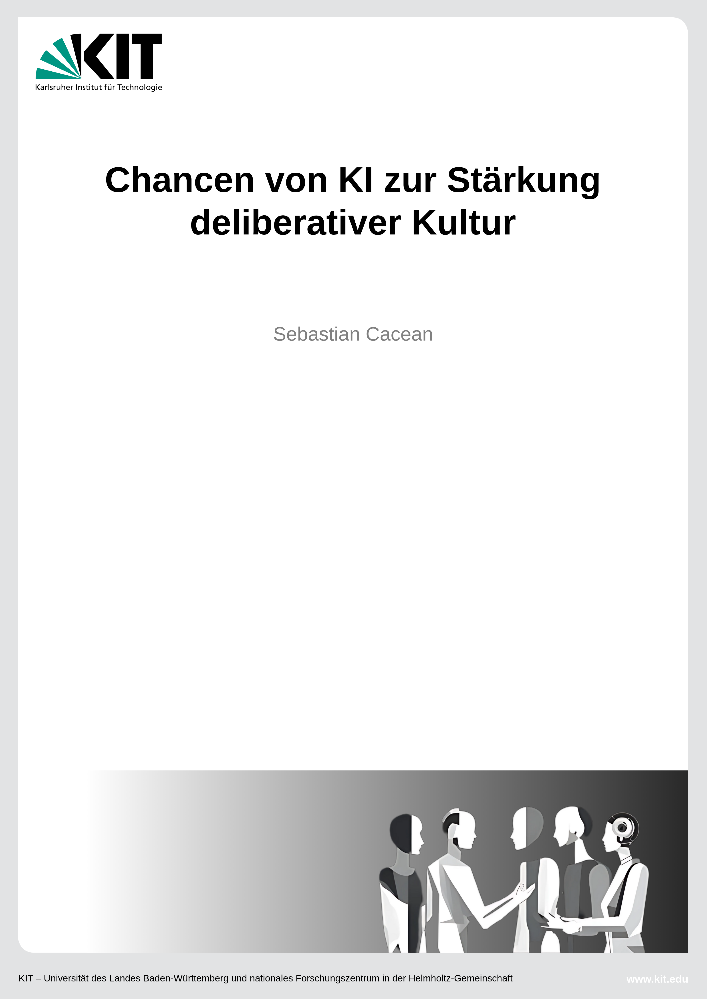
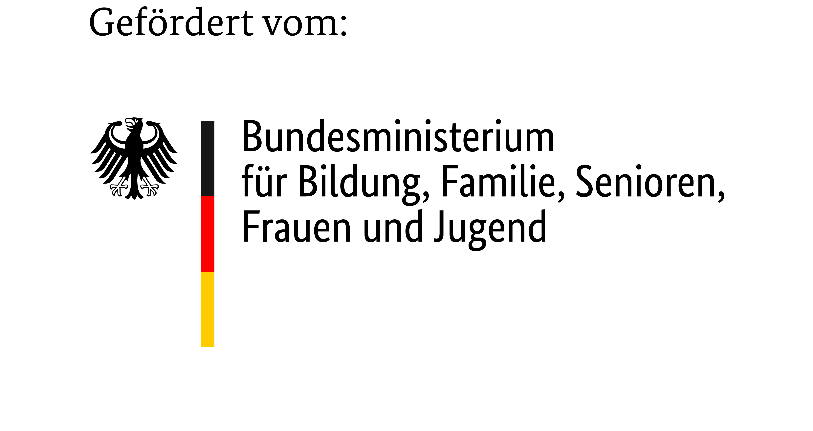

# Home {.unnumbered}

<a href="./Chancen-von-KI-zur-Stärkung-deliberativer-Kultur.pdf" target="_blank" class="float-right" style="width:220px;">
  
</a>

Generative Sprachmodelle verändern die Informationsproduktion und -verarbeitung grundlegend. Wenngleich diese Technologie von manipulativen Akteur:innen missbraucht werden kann, um liberale Demokratien zu schwächen, bietet sie zugleich große Chancen, die öffentliche Diskurslandschaft und politische Willensbildung zu stärken. Im Projekt [„Chancen von KI zur Stärkung unserer deliberativen Kultur"](https://compphil2mmae.github.io/de/research/kideku/) (KIdeKu) haben wir untersucht, wie Sprachmodelle öffentlichen Diskurs und Beteiligung stärken können. Der vorliegende Bericht dokumentiert die zentralen Ergebnisse des Projekts. Zunächst werden Einsatzszenarien für Sprachmodelle in deliberativen Kontexten identifiziert und systematisiert. Anschließend werden die im Projekt entwickelten Prototypen und Datensätze vorgestellt: der *KIdeKu Toxicity-Detector* zur Erkennung toxischer Sprache, die *EvidenceSeeker-Boilerplate* für KI-basiertes Fact-Checking sowie der synthetische *syncIALO-Datensatz* für Argumentation. Abschließend werden Herausforderungen und Empfehlungen für den Einsatz von KI in deliberativen Kontexten formuliert. Dabei wird insbesondere auf die zentrale Rolle von Vertrauen und systematischer Evaluierung eingegangen.

<div style="clear:both;"></div>

<!--
Der Bericht dokumentiert die Ergebnisse des KIdeKu-Projekts, das untersuchte, wie generative Sprachmodelle zur Stärkung deliberativer Demokratie eingesetzt werden können. Er systematisiert Einsatzszenarien, stellt die entwickelten Open-Source-Prototypen vor und formuliert Empfehlungen für den verantwortungsvollen KI-Einsatz in deliberativen Kontexten, wobei die Bedeutung von Vertrauen und systematischer Evaluierung betont wird.
-->
## Das Projekt

<a href="https://www.bmbfsfj.bund.de/" target="_blank" class="float-right funding-logo">
  
</a>

Das diesem Bericht zugrundeliegende Vorhaben „Chancen von KI zur Stärkung unserer deliberativen Kultur" wurde am [Karlsruher Institut für Technologie](https://www.kit.edu/) (KIT) im Arbeitsbereich [Computationale Philosophie, Philosophische Methoden, Moralphilosophie & Angewandte Ethik](https://compphil2mmae.github.io/de/) (CompPhil²MMAE) durchgeführt und vom Bundesministerium für Bildung, Familie, Senioren, Frauen und Jugend (BMBFSFJ) im Rahmen der Richtlinie zur Förderung von Künstlicher Intelligenz für das Gemeinwohl gefördert (Projektlaufzeit: 01.06.2024–31.12.2025). Das Projekt wurde von den folgenden Personen getragen und durchgeführt:

+ Prof. Dr. Gregor Betz (Projektleitung)
+ Prof. Dr. Christian Seidel (Projektleitung)
+ Dr. Sebastian Cacean (Projektmanagement und -durchführung)
+ Dr. Inga Bones (Projektdurchführung)
+ Leonie Wahl (studentische Mitarbeiterin)
+ Reta Lüscher-Rieger (studentische Mitarbeiterin)
+ Leon Knauer (studentischer Mitarbeiter)

<div style="clear:both;"></div>


## Lizenz

<a href="https://creativecommons.org/licenses/by-sa/4.0/" target="_blank" class="float-right" style="margin-left:24px;">
  
</a>

Das vorliegende Werk ist lizensiert unter der Creative Commons Namensnennung –
Weitergabe unter gleichen Bedingungen 4.0 International ([CC BY-SA 4.0](https://creativecommons.org/licenses/by-sa/4.0/)).

<div style="clear:both;"></div>


## Zitierweise

BibTex:

```bibtex
@article{cacean_xx_2026,
  title = {Chancen von KI zur Stärkung deliberativer Kultur},
  author = {Cacean, Sebastian},
  year = {2026},
  month = march,
  doi = {xx},
  langid = {german},
  url = {xx},
}
```

::: {.callout-note icon=false}
## Zitierweise (Beispiel):
Cacean, S. (2026). *Chancen von KI zur Stärkung unserer deliberativen Kultur - Abschlussbericht*. <https://xxx>
:::

