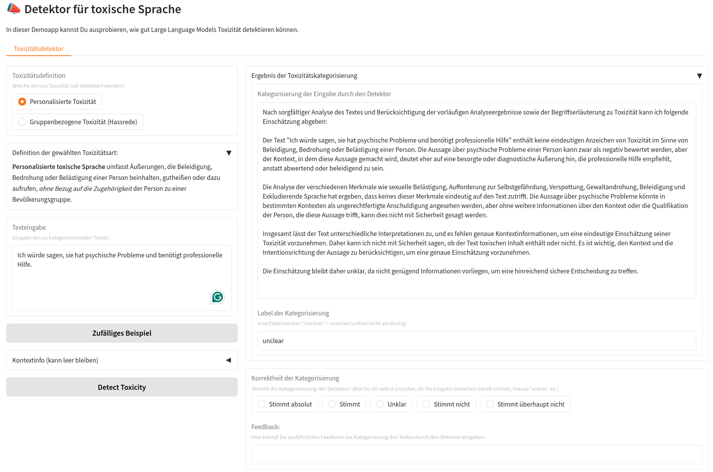
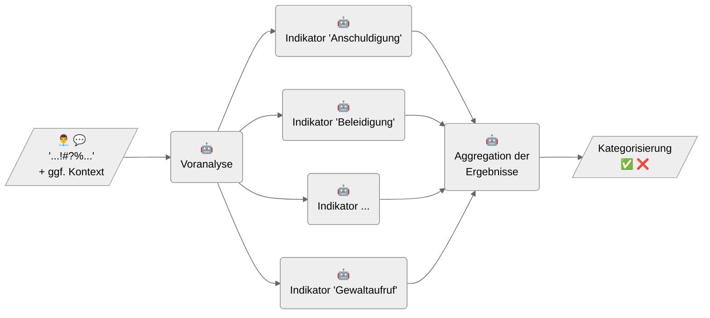
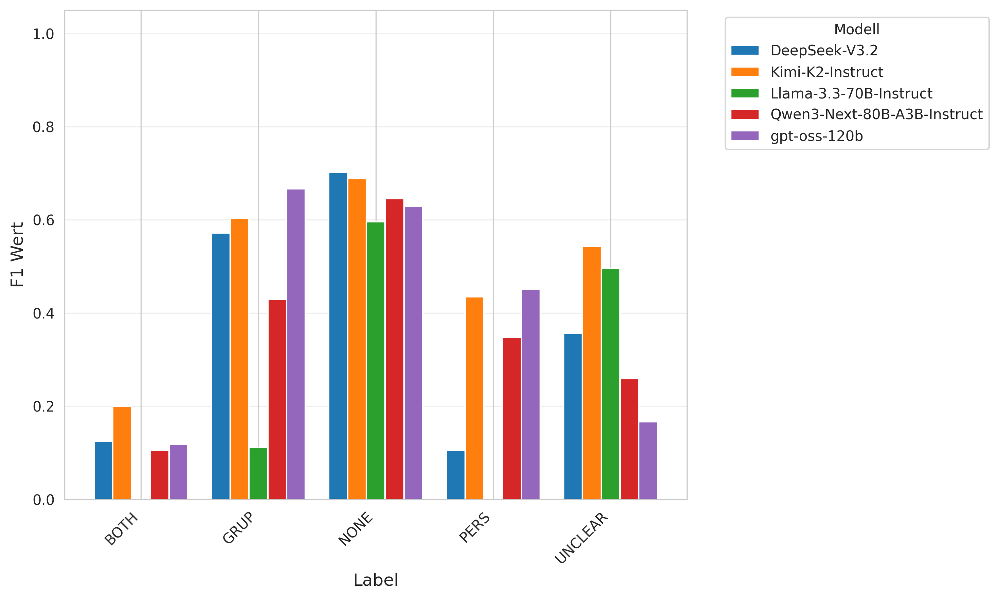
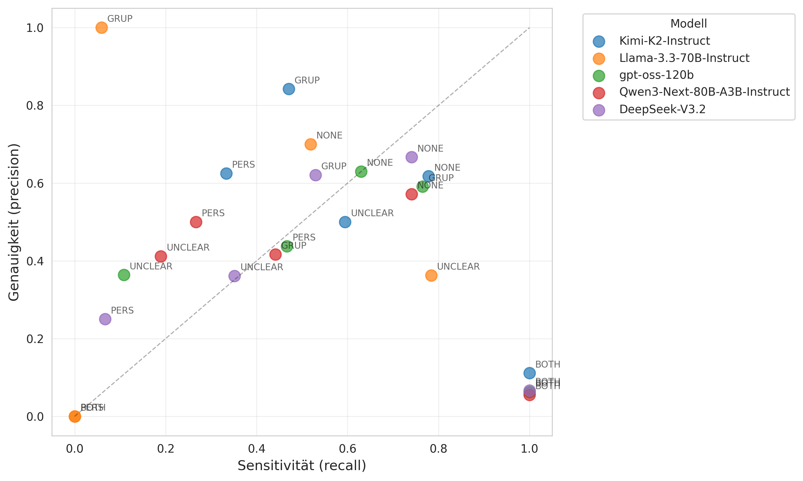
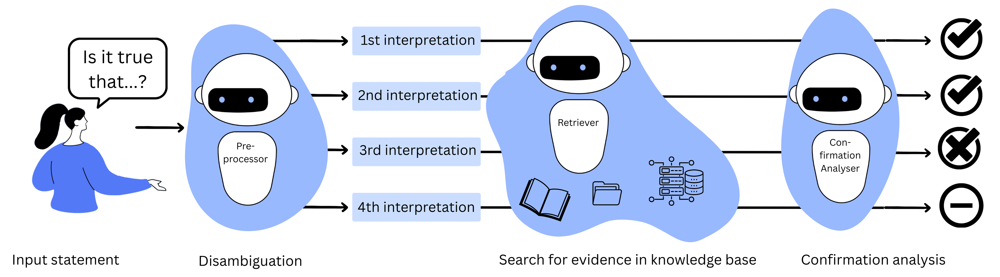
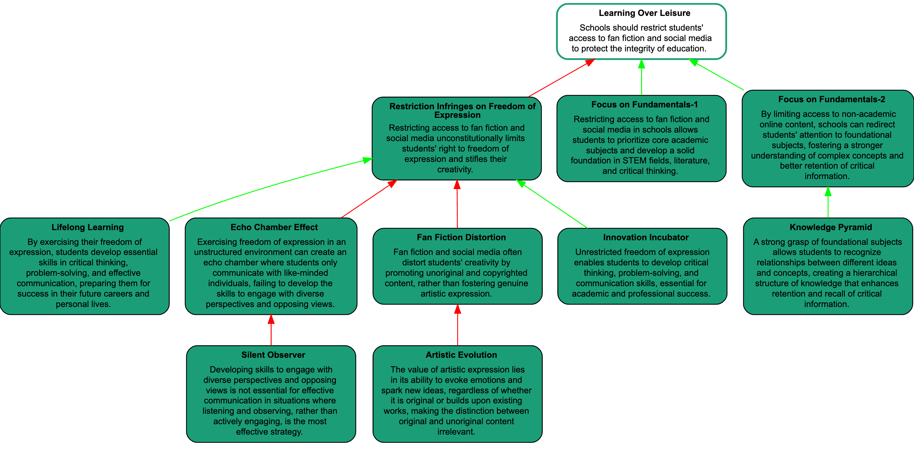

# Projektergebnisse {#sec-projektergebnisse}

Zentrales Ziel des KIdeKu-Projekts war die Entwicklung von LLM-basierten Prototypen und Datensätzen, die in unterschiedlichen Szenarien eingesetzt werden können. Wir haben insgesamt zwei Prototypen entwickelt und einen synthetischen Datensatz erstellt. 

Der *KIdeKu Toxicity-Detector* ist ein KI-gestütztes Tool zur Identifizierung toxischer Sprache in Texteneingaben anhand konfigurierbarer Indikatoren. Die entwickelte *EvidenceSeeker-Boilerplate* ist ein Code-Template, mit dem Organisationen eigene oder kuratierte Wissensbestände nutzen können, um KI-basierte Fact-Checking-Tools aufzusetzen.^[In der Softwareentwicklung bezeichnet „Boilerplate“ vorgefertigten, wiederverwendbaren Code, der grundlegende Strukturen oder Funktionen bereitstellt. In diesem Sinne stellt die *EvidenceSeeker-Boilerplate* ein Grundgerüst bereit, mit dem KI-Tools zum evidenzbasierten Faktencheck aufgebaut werden können.]

Die entwickelten Prototypen können als Proof-of-Concepts verstanden werden, die zeigen, wie KI in deliberativen Kontexten eingesetzt werden könnte, und sind in Form von Demo-Apps verfügbar, mit denen sich Interessierte spielerisch mit den Möglichkeiten von Sprachmodellen vertraut machen können. Sie können als Inspiration für eigene Entwicklungen dienen und darüber hinaus auch als Ausgangspunkt für darauf aufbauende Weiterentwicklungen. 

Der im Projekt erstellte *syncIALO Datensatz* enthält Argumente, die als Argumentkarten organisiert sind. Mit ihm können spezifischere Datensätze erstellt werden, um Sprachmodelle für argumentationsanalytische Aufgaben zu trainieren und zu evaluieren.

## 📢 Toxicity-Detector {#sec-tode}

Der Begriff „toxische Sprache“ ist weder klar definiert noch von teilweise ähnlichen Begriffen scharf abgegrenzt [@fortuna_toxic_2020]. Hier wird er als Oberbegriff verstanden, der verschiedene Phänomene wie Hassrede, Beleidigung, Herabwürdigung, Bedrohung und Hetze umfasst. Die Verwendung toxischer Sprache verstößt gegen die deliberative Norm des respektvollen Umgangs (siehe @sec-civility). Die korrekte Detektion toxischer Sprache ist relevant, um festzustellen, ob die Norm im deliberativen Austausch erfüllt wird, und damit Grundlage eines lösungsorientierten Umgangs mit toxischer Sprache -- beispielsweise durch die Löschung entsprechender Beiträge.

Ohne eine automatisierte oder zumindest KI-assistierte Detektion muss die Annotation toxischer Sprache vollständig von Menschen durchgeführt werden, was mit einer Reihe von Problemen verbunden ist. Zum einen wird diese Arbeit typischerweise in Länder des Globalen Südens ausgelagert, wo Menschen z.T. unter Bedingungen arbeiten, die Menschenrechtsstandards nicht erfüllen, und den mit der Detektion von toxischer Sprache verbundenen psychischen Belastungen meist ohne professionelle Hilfe ausgesetzt sind [@qureshi_explainable_2025].

Hinzu kommt, dass eine Kategorisierung toxischer Sprache durch Menschen je nach Einsatzkontext sehr zeitintensiv ist. Der Aufwand wächst linear mit der zu analysierenden Textmenge. Durch die Möglichkeit KI-basierter Generierung toxischer Sprache wird dieses Skalierungsproblem nur noch verschärft.

Diese Probleme könnten durch den Einsatz von Sprachmodellen gelöst werden, sofern die Detektion hinreichend genau ausfällt.

Der im KIdeKu-Projekt entwickelte Toxicity-Detector ist ein LLM-basierter Prototyp, der Texteingaben hinsichtlich toxischer Sprache analysiert und kategorisiert. Der in Python implementierte Prototyp ist Open Source und kann durch seine MIT-Lizenz frei genutzt und weiterentwickelt werden. Er enthält ein rudimentäres User Interface, mit dem Nutzer:innen den Prototypen ausprobieren können, sowie eine Befehlszeilenschnittstelle (CLI) zur Integration in andere Systeme.^[Weitere technische Details zur Installation und Verwendung findet man im GitHub-Repository des Prototypen: <https://github.com/debatelab/toxicity-detector>.] Der Toxicity-Detector ist aufgrund seiner Konfigurationsmöglichkeiten sehr flexibel. Es lassen sich  unterschiedliche Sprachmodelle verwenden und alle benutzten Prompts und Parameter anpassen.

Bei der Detektion toxischer Sprache wird zwischen zwei Arten von Toxizität unterschieden: gruppenbezogene Toxizität (Hassrede) und personenbezogene Toxizität. Erstere umfasst Beleidigungen, Herabwürdigungen, Bedrohungen und Hetze sowie andere Formen übergriffiger und feindseliger Sprache, die sich gegen Gruppen oder Personen *aufgrund ihrer Gruppenzugehörigkeit* (z.B. Ethnie, Religion, Geschlecht oder sexuelle Orientierung) richten. Personenbezogene Toxizität richtet sich in gleicher Weise gegen Personen  allerdings *ohne einen spezifischen Gruppenbezug*. 

Der Prototyp ermöglicht die Detektion beider Arten von Toxizität und berücksichtigt dabei kontextuelle Faktoren, die für die Interpretation der Eingabe relevant sein können und der Pipeline als Beschreibung übergeben werden müssen. Als Ergebnis gibt der Detektor eine natürlichsprachliche Einschätzung samt Begründung und ein Label zurück, das einen der drei Werte `true`, `false` oder `unclear` annehmen kann. Mit dem Label `unclear` kann der Detektor ausdrücken, dass nicht genügend Informationen vorliegen, um eine hinreichend sichere Einschätzung zu treffen.

{width=90%}


### Die Toxicity-Detector Pipeline

Der Toxicity-Detector basiert auf einer Pipeline, die die Analyse der Texteingabe in drei aufeinanderfolgenden Schritten vornimmt. Diese einzelnen Schritte bestehen aus aufeinander aufbauenden Anfragen an ein Sprachmodell, die als konfigurierbare Prompts formuliert sind. Dabei werden die Ergebnisse eines vorangegangenen Schritts als Kontextinformationen für die Anfrage des nächsten Schritts genutzt. 



Im ersten Schritt der **Voranalyse** beantwortet das Modell allgemeine Fragen zur Texteingabe, deren Beantwortung im zweiten Schritt der **Indikatorenanalyse** dem Modell als zusätzliche Kontextinformation mitgegeben wird. Für beide Toxizitätsarten gibt es eine Reihe konfigurierbarer Indikatoren, die typische Formen von Toxizität darstellen (z. B. Drohungen, Beleidigungen, Victim Shaming). Das Modell bewertet für jeden Indikator unabhängig, ob er auf die Texteingabe zutrifft oder nicht. Im letzten Schritt der **Ergebnisaggregation** wird das Modell auf Grundlage der Zwischenergebnisse und einer Begriffserläuterung der Toxizitätsart aufgefordert, eine Gesamteinschätzung abzugeben. 

Die Prompts für die einzelnen Schritte, inklusive der Definition der unterschiedlichen Indikatoren, können über eine YAML-Datei konfiguriert werden, sodass die Pipeline flexibel an unterschiedliche Anwendungsfälle und Modelle angepasst werden kann. Die voreingestellte Vorlage für den Prompt der Voranalyse enthält beispielsweise die folgenden Fragen:^[Die anderen voreingestellten Prompts können unter <https://github.com/debatelab/toxicity-detector/blob/main/src/toxicity_detector/package_data/default_pipeline_config.yaml> eingesehen werden.]

```txt
Aufgabe: Beantworte die folgenden Fragen über den zu analysierenden 
Text.
- Werden im Text negative Begriffe verwendet? Wenn ja, welche?
- Richtet sich der Text gegen eine einzelne Person oder eine Gruppe? 
  Wenn ja, gegen wen?
- Verwendet der Text Ironie, d.h. Sprache, bei der das eigentlich
  Gemeinte durch dessen Gegenteil ausgedrückt wird? Wenn ja, was
  ist die eigentliche Bedeutung des Texts?
- Bezieht sich der Text auf eine andere Aussage, z.B. über ein Zitat,
  das durch Anführungszeichen gekennzeichnet wird? Wenn ja, wie wird
  die andere Aussage vom Text bewertet?

/// Der Text, den Du analysieren sollst:
{{ user_input }}
///
Beachte für die Analyse die folgenden relevanten
Kontextinformationen:
{{ context_information }}.

Hinweise:
- Starte die Antwort nicht mit "Ja, ..." bzw. "Nein, ..." Formuliere
  die Antworten einfach als Aussagen.
- Du musst die Antworten nicht erklären.

```

### Explorative Evaluierung des Toxicity-Detectors {#sec-tode-eval}

Die KI-basierte Detektion toxischer Sprache kann nur dann in der Praxis eingesetzt werden, wenn sie hinreichend genau ist. Daher ist es unerlässlich die Leistungsfähigkeit entsprechender KI-Systeme kritisch zu evaluieren. Die Verwendung von Testdatensätzen stellt eine Möglichkeit der systematischen Evaluation dar. Solche Testdatensätze müssen eine hinreichend große Menge von Beispieltexten sowie korrekte Labels hinsichtlich ihrer Toxizität enthalten. Diese Labels werden von Menschen, die die Texteingaben manuell annotieren, oder synthetisch erstellt. Auf diese Weise entsteht ein sogenannter „Goldstandard“, der als Referenz für die Bewertung von KI-Modellen dienen kann.

Für die Evaluation von Hassrede und Toxizität gibt es bereits eine Fülle etablierter Testdatensätze in unterschiedlichen Sprachen.^[Für einen Überblick vgl. @bertram_comparative_2023 und @yu_unseen_2024.] Daher lag es nahe, bestehende Datensätze zu nutzen, um die Leistung des KIdeKu Toxicity-Detectors zu evaluieren. Die Verwendung dieser Datensätze war jedoch mit Schwierigkeiten verbunden: Da es keine normierte Bedeutungserläuterung für toxische Sprache gibt, ist nicht sichergestellt, dass die Labels in den verschiedenen Datensätzen der im KIdeKu-Projekt verwendeten Toxizitätsdefinition entsprechen. Vielmehr muss das für jeden Datensatz erst geprüft werden, bevor er als Grundlage für die Evaluation dienen kann. Andernfalls ist die Validität der Evaluation nicht sichergestellt.

Die Annotationsrichtlinien des HASOC 2019 Datensatzes [@mandl_overview_2019] und des GermEval 2018 Datensatzes [@wiegand_overview_2018] wiesen hinreichend große Ähnlichkeiten mit der von uns verwendeten Toxizitätsdefinition auf. Für beide Datensätze haben wir eine Teilmenge der Einträge von zwei Annotator:innen unabhängig voneinander neu kategorisiert, um zu prüfen, ob die verwendeten Toxizitätsdefinitionen hinreichend ähnlich sind. Die Übereinstimmung der Reannotation mit der originalen Annotation war jedoch sehr gering.^[Krippendorffs $\alpha$ betrug lediglich $\sim 0,3$.] Eine mögliche Erklärung für die geringe Übereinstimmung ist auf einen zentralen Mangel in beiden Datensätzen zurückzuführen: Im Gegensatz zu unserem Annotationsschema gab es im Rahmen der originalen Annotation keine Möglichkeit, Unsicherheiten zu markieren. Im Annotationsschema ging man davon aus, dass die zu annotierenden Einträge eindeutig toxisch oder nicht toxisch sind. Das ist insofern verwunderlich, als dass die Datensätze keine Kontextinformationen zu den Einträgen enthalten, die für deren Interpretation relevant sein könnten, um Mehrdeutigkeiten aufzulösen. In der Reannotation wurden tatsächlich viele Einträge als „unklar“ markiert.^[Details können unter <https://github.com/debatelab/toxicity-detector-eval/blob/main/notebooks/goldstandard_analysis.ipynb> eingesehen werden.]

Aufgrund dieser Ergebnisse haben wir uns entschieden, die vorhandenen Datensätze nicht direkt für die Evaluation zu verwenden. Wir haben lediglich die 114 von uns reannotierten Einträge für eine explorative Evaluierung verwendet.^[Sowohl die geringe Größe dieses Testdatensatzes als auch die geringe Inter-Coder-Übereinstimmung der reannotatierten Texte (Krippendorffs $\alpha=\sim 0,6$) lassen keine belastbaren Schlussfolgerungen zu.] 

Wir gingen folgendermaßen vor: Die Pipeline selbst führt zwei getrennte Kategorisierungen unabhängig voneinander durch, nämlich die Kategorisierung der personenbezogenen und die der gruppenbezogenen Toxizität (Hassrede). Die Ergebnisse dieser Teilschritte (`true`, `false` oder `unclear`) wurden anschließend zu einem Gesamtlabel kombiniert (siehe @tbl-finallabels).

| personenbezogene Toxizität | gruppenbezogenen Toxizität | Gesamtlabel |
| --- | --- | --- |
| `false` | `false` | `NONE` |
| `true` | `false` | `PERS` |
| `false` | `true` | `GRUP` |
| `true` | `true` | `BOTH` |
| `unclear` | any | `UNCLEAR` |
| any | `unclear` | `UNCLEAR` |

: Konstruktion des  Gesamtlabels aus den Ergebnissen der Teilkategorisierungen. {#tbl-finallabels}

Für die Evaluation der Pipeline wurden die so gewonnenen Gesamtlabels mit den entsprechenden Labels des reannotierten Testdatensatzes verglichen. Wir haben dabei insgesamt fünf offene Modelle untersucht, nämlich [Kimi-K2-Instruct](https://huggingface.co/moonshotai/Kimi-K2-Instruct), [gpt-oss-120b](https://huggingface.co/openai/gpt-oss-120b), [Qwen3-Next-80B-A3B-Instruct](https://huggingface.co/Qwen/Qwen3-Next-80B-A3B-Instruct), [DeepSeek-V3.2](https://huggingface.co/deepseek-ai/DeepSeek-V3.2) und [Llama-3.3-70B-Instruct](https://huggingface.co/meta-llama/Llama-3.3-70B-Instruct).





Die Ergebnisse der Evaluation legen nahe, dass die Pipeline in ihrer jetzigen Form mit den getesteten Modellen noch nicht für den Einsatz in der Praxis geeignet ist. Bezüglich aller Labels erreicht die Pipeline nur unzureichende $F_1$ Werte ($<0,7$). Allerdings zeigt die Analyse auch, dass die Pipeline durchaus in der Lage ist, Mehrdeutigkeiten als solche zu erkennen. Auch wurde die Pipeline noch nicht auf die getesteten Modelle optimiert (beispielsweise durch eine systematische Anpassung der Prompts), so dass die Ergebnisse als vorläufige Einschätzung zu verstehen sind. In einem weiteren Schritt wäre es notwendig, die Pipeline mit einem größeren Testdatensatz zu evaluieren, der zunächst erstellt werden muss.

## 🕵️‍♀️ EvidenceSeeker Boilerplate {#sec-evse}

<!-- Grobe Beschreibung -->
Die im Projekt entwickelte *EvidenceSeeker-Boilerplate* ist ein Codetemplate, mit dem Organisationen eigene bzw. selbst kuratierte Wissensbestände nutzen können, um KI-basierte Fact-Checking-Tools aufzusetzen. Die EvidenceSeeker-Boilerplate ist also selbst keine Anwendung, sondern eine Vorlage, mit der auf einfache Weise eine solche Anwendung erstellt werden kann. 

Die Konzeption dieses Prototyps als Codetemplate ist durch folgende Überlegungen motiviert: Ein wichtiger Bestandteil jedes Faktenchecks ist die Suche nach verlässlichen und relevanten Quellen, die beschreiben, ob und in welchem Maße es Evidenzen für die in Frage stehende Aussage gibt, beziehungsweise Evidenzen, die im Widerspruch mit ihr stehen. Man kann den Faktencheckprozess grob in folgende Schritte zerlegen:

1. Welche Quellen sind thematisch relevant für die in Frage stehende Aussage? Das Wort „relevant“ soll hier nur thematische Relevanz bezeichnen. Bei Klimaaussagen wären damit alle Quellen, die das Klima betreffen, prinzipiell relevant. 
2. Welche der thematisch relevanten Quellen sind verlässlich? Verlässlich soll heißen, dass die Quellen selbst keine Falschaussagen enthalten beziehungsweise den einschlägigen wissenschaftlichen Standards entsprechen und damit gut begründet sind.
3. In welchem Bestätigungsverhältnis steht die in Frage stehende Aussage zu den Aussagen in den Quellen? Bestätigen sie die in Frage stehende Aussage oder widerlegen sie sie?

Die EvidenceSeeker-Boilerplate stellt eine KI-basierte Lösung für den dritten Schritt dar. Ausgangspunkt ist eine Wissensbasis (zum Beispiel in Form einer Menge von PDF-Dateien), die den zu einem bestimmten Thema oder einer bestimmten Frage relevanten Wissensstand abbildet -- also die Menge relevanter und verlässlicher Quellen zu dem Thema. Ob die Quellen tatsächlich relevant und verlässlich sind, wird vom EvidenceSeeker nicht geprüft, sondern vorausgesetzt und muss extern validiert werden. Die so aufgesetzten EvidenceSeeker-Instanzen können dann verwendet werden, um in der Wissensbasis nach bestätigenden und widerlegenden Informationen zu suchen. 

Am besten stellt man sich diese EvidenceSeeker als themenspezifische Faktenchecker vor. So könnte es beispielsweise einen Klimawandelfaktenprüfer geben, dem man als Wissensbasis alle einschlägigen wissenschaftlichen Artikel und Berichte zum Klimawandel bereitstellt, und der dann prüfen kann, ob Aussagen (über das Klima) durch diese Wissensbasis bestätigt oder widerlegt werden. 

<!-- Projektoutputs -->
Auf der praktischen Seite richtet sich die EvidenceSeeker-Boilerplate an Akteur:innen, die über eigene Wissensbestände verfügen oder diese kuratieren und zum Faktencheck nutzen oder anbieten möchten. Ähnlich wie der Toxicity-Detector ist die Boilerplate Open Source (unter einer MIT-Lizenz) und über viele Konfigurationsmöglichkeiten an Anforderungen und Präferenzen anpassbar. Insbesondere lassen sich EvidenceSeeker mit unterschiedlichen Modellen betreiben. Der Prototyp ist in der jetzigen Form zwar noch nicht ohne Weiteres für einen skalierbaren und verlässlichen Betrieb geeignet, kann jedoch sinnvoll als Ausgangsbasis für Optimierungen und Weiterentwicklungen dienen. Die im Projekt entwickelten Bausteine umfassen:


1. den Quellcode (<https://github.com/debatelab/evidence-seeker>), 
2. eine ausführliche Dokumentation (<https://debatelab.github.io/evidence-seeker/>), 
3. eine Webseite mit Beispielergebnissen (<https://debatelab.github.io/evidence-seeker-results/>),
4. eine Gradio DemoApp (<https://huggingface.co/spaces/DebateLabKIT/evidence-seeker-demo>), die lokal aufgesetzt und getestet werden kann und
5. das EvidenceSeeker Portal (<https://evidence-seeker.philosophie.kit.edu/>), über das Personen ohne technische Kenntnisse EvidenceSeeker aufsetzen und testen können.

{width=90%}

### Die EvidenceSeeker-Pipeline
<!-- Erläuterung der Pipeline: Überblick -->
Die EvidenceSeeker-Boilerplate basiert auf einer Pipeline, in der eine Eingangsaussage in drei aufeinander aufbauenden Schritten geprüft wird.

Im ersten Schritt der **Disambiguierung** identifiziert die Pipeline Mehrdeutigkeiten und Vagheit, löst diese durch mögliche Interpretationen auf und unterscheidet dabei zwischen deskriptiven, zuschreibenden und normativen Aussagen. Diese Disambiguierung erfolgt durch Anfragen an ein Sprachmodell, das als Ergebnis eine Menge von Aussagen zurückgibt. Jede dieser Aussagen entspricht einer gefundenen Interpretation mit einem eindeutigen Aussagentyp.

Im zweiten Schritt der **Extraktion** werden aus der zugrunde liegenden Wissensbasis für jede Interpretation thematisch relevante Textstellen extrahiert, die somit potentielle Evidenzen darstellen.

Im dritten Schritt der **Bestätigungsanalyse** wird dann für jede dieser Textstellen durch erneute Anfragen an ein Sprachmodell geprüft, in welchem Maße die Textstelle die Interpretation stützt oder widerlegt. Die so gewonnenen Ergebnisse werden dann für jede Interpretation zu einer Gesamtaussage aggregiert, die den User:innen mitteilt, inwiefern die Interpretation durch die Wissensbasis gestützt oder widerlegt wird.

{width=80%}

Die einzelnen Ergebnisse für jede Interpretation werden allerdings nicht zu einer Gesamteinschätzung über die Eingangsaussage aggregiert. Als Ergebnis liefert die Pipeline also eine differenzierte Analyse. Das mag Nutzer:innen womöglich unbefriedigend erscheinen, ist jedoch bewusst intendiert: Enthält die Eingangsaussage Vagheit oder Mehrdeutigkeit, kommt es für die Wahrheitsbeurteilung der Aussage darauf an, wie man sie interpretiert. In einem solchen Fall lässt sich nichts Weiteres über den Wahrheitsgehalt der Eingangsaussage ableiten. Enthält die Eingangsaussage hingegen keine relevante Vagheit und keine relevanten Mehrdeutigkeiten, sollte die Pipeline auch nur eine Interpretation finden, die bedeutungsgleich mit der Eingangsaussage ist.

Schauen wir uns die einzelnen Schritte etwas genauer an.^[Weitere Details zur Pipeline unter <https://debatelab.github.io/evidence-seeker/workflow.html>.]

#### Disambiguierung
<!-- Disambiguierungsschritte -->

Ziel der Voranalyse ist die Disambiguierung der zu prüfenden Aussage. Dabei sollen relevante Mehrdeutigkeiten aufgelöst und zwischen deskriptiven, normativen und zuschreibenden Aussagen unterschieden werden. Warum ist das wichtig? 

Die Auflösung von Vagheit und Mehrdeutigkeit ist in vielen Fällen für einen Faktencheck notwendig, wie das folgende Beispiel illustriert: Die Aussage *„Julian ist groß“* ist ohne weiteres Kontextwissen keiner sinnvollen Wahrheitsprüfung zugänglich. Wir müssen zunächst verstehen, was genau der:die Sprecher:in mit der Aussage meint und gegebenenfalls mehr über die betreffende Person erfahren. Was ist der implizite Vergleichskontext? Meint der:die Sprecher:in groß für ein Kind in diesem Alter, in der subjektiven Wahrnehmung oder im Vergleich zum letzten Mal, als der:die Sprecher:in die Person gesehen wurde? Usw.

Auch die Unterscheidung zwischen deskriptiven, zuschreibenden und normativen Aussagen ist für die Wahrheitsprüfung relevant.

**Deskriptive Aussagen** sind beschreibende Aussagen, die in Abhängigkeit von dem, was in der Welt der Fall ist, wahr oder falsch sind. In der Regel sind diese Aussagen in einem gewissen Maße durch empirische Beobachtungen überprüfbar. Für deskriptive Aussagen geht es daher im Faktencheck um das Auffinden relevanter empirischer Evidenzen. Vom EvidenceSeeker erwarten wir, dass er in einer Wissensbasis Aussagen findet, die solche Evidenzen beschreiben, und den entsprechenden Bestätigungs- beziehungsweise Widerlegungsgrad ermittelt.

**Zuschreibende Aussagen** sind eine besondere Klasse deskriptiver Aussagen: Sie schreiben Personen oder Gruppen Aussagen zu. Die Personen oder Gruppen können dabei unbestimmt bleiben. Die Aussage *„Manche Menschen denken, dass es keinen menschengemachten Klimawandel gibt“* sagt, dass es Menschen gibt, denen die Überzeugung zugeschrieben werden kann, dass es keinen menschengemachten Klimawandel gibt. Insofern zuschreibende Aussagen deskriptive Aussagen sind, gilt das oben bereits Gesagte für sie gleichermaßen. Allerdings muss zwischen der Zuschreibung und der zugeschriebenen Aussage unterschieden werden, da die jeweiligen Wahrheitsprüfungen unabhängig vorgenommen werden müssen und unterschiedlich ausfallen können. So ist die Beispielaussage zwar wahr, aber die zugeschriebene Aussage falsch. Darüber hinaus wird man unter Umständen unterschiedliche Wissenbasen für die Überprüfung verwenden müssen. Während für die Beispielaussage die Ergebnisse entsprechender Umfragen berücksichtigt werden können, benötigt man für die Prüfung der zugeschriebenen Aussage Erkenntnisse aus den Klimawissenschaften.

Von einem EvidenceSeeker erwarten wir, dass er zuschreibende Aussagen als solche erkennt und zwischen Zuschreibung und zugeschriebener Aussage unterscheidet.

Der dritte Typ relevanter Aussagen umfasst **normative Aussagen**, zum Beispiel Wertaussagen, Gebote, Verbote und Empfehlungen. Bei den normativen Aussagen lässt sich fragen, ob sie überhaupt einem Faktencheck unterzogen werden können. Normative Aussagen werden häufig so verstanden, dass sie nicht in derselben Weise richtig oder falsch sein können wie deskriptive Aussagen und dass sie sich auch nicht allein durch empirische Beobachtungen überprüfen lassen. Unabhängig davon lässt sich natürlich prüfen, in welchem Begründungsverhältnis solche Aussagen zu anderen normativen Aussagen stehen. Auch wenn die bisherigen Formulierungen der Evidenzsuche nicht ganz passen, wäre das Vorgehen der „Prüfung“ solcher Aussagen anhand einer „Wissensbasis“ nicht anders als bei deskriptiven Aussagen. So ließe sich beispielsweise analysieren, ob eine gegebene normative Aussage Regelungen des Grundgesetzes widerspricht oder durch sie gestützt wird, indem als Wissensbasis das Grundgesetz selbst und die Urteile des Bundesverfassungsgesetzes herangezogen werden.

In der Konfiguration der EvidenceSeeker-Boilerplate lässt sich festlegen, ob normative Aussagen geprüft werden sollen. In der Voreinstellung werden normative Aussagen als solche erkannt, jedoch im weiteren Verlauf der Pipeline nicht weiter geprüft. So werden gefundene normative Interpretationen der Eingangsaussage zwar als Ergebnis zurückgegeben, allerdings ohne eine daran geknüpfte Bestätigungsanalyse.

Insgesamt ist die Unterscheidung zwischen deskriptiven, zuschreibenden und normativen Aussagen für Faktenchecks relevant, da für deren Wahrheitsprüfung zum Teil unterschiedliche Kriterien einschlägig sind. Es ist daher notwendig, diese Aussagen vor der eigentlichen Prüfung zu unterscheiden und entsprechende Mehrdeutigkeiten aufzulösen.

#### Extraktion
<!-- Retrievalkomponente -->

Im Extraktionsschritt wird für jede gefundene Interpretation nach thematisch relevanten Textstellen in der Wissensbasis gesucht. Technisch wird dazu *Retrieval Augmented Generation* (RAG) herangezogen. RAG ist eine sehr verbreitete Methode, um Anfragen an Sprachmodelle mit Kontextinformationen aus einer externen Wissensbasis anzureichern. Damit soll üblicherweise die Zuverlässigkeit der Antworten von Sprachmodellen verbessert werden, um sogenannte „Halluzinationen“ zu vermeiden, also die Generierung von Antworten, die zwar plausibel klingen, aber faktisch falsch sind. 

RAG wird typischerweise mithilfe von Embeddingmodellen realisiert. Mit diesen Modellen werden Textstellen als hochdimensionale reelwertige Vektoren repräsentiert, die ihre semantische Bedeutung repräsentieren. Liegen die Repräsentationen zweier Textstellen im Vektorraum nah beieinander, sind sie auch thematisch ähnlich -- so die Idee.

Im Rahmen der EvidenceSeeker-Boilerplate wird die gesamte Wissensbasis in Textstellen zerlegt, die anschließend mithilfe eines Embedding-Modells in Vektoren umgewandelt werden. Der so erzeugte Index wird dann bei jeder Suche nach relevanten Textstellen für eine Interpretation durchsucht und die acht thematisch ähnlichsten Textstellen werden zurückgegeben.^[Diese Zahl ist ein konfigurierbarer Parameter (${top}_k$).]

Wie gut eine solche Extraktion funktioniert, hängt von verschiedenen Faktoren ab, beispielsweise von der Art der Zerlegung und der Qualität des Embeddingmodells. 

#### Bestätigungsanalyse
<!-- Aggregationskomponente -->
Von den so zurückgegebenen Textstellen ist aber noch nicht klar, ob sie die Interpretation stützen oder widerlegen, oder ob sie sie weder stützen noch widerlegen. Darum wird in der Bestätigungsanalyse ein Sprachmodell befragt, den Grad der Bestätigung bzw. Widerlegung anhand der Textstellen zu beurteilen. Dies wird für jede Textstelle separat gemacht. Genauer gesagt, wird das Modell über eine Multiple-Choice-Frage gebeten, zu entscheiden, ob die Textstelle hinreichende Evidenz zur Unterstützung der Interpretation liefert, ob sie Evidenz liefert, die der Interpretation widerspricht, oder ob sie die Interpretation weder unterstützt noch ihr widerspricht.

Für jede Interpretation und jede relevante Textstelle wird so ein Bestätigungsgrad berechnet, der Werte zwischen $-1$ und $1$ annehmen kann, wobei $-1$ maximale Widerlegung durch die Textstelle, $1$ maximale Bestätigung und $0$ keine Bestätigung bedeutet.^[Technisch werden diese Bestätigungsgrade aus den Tokenwahrscheinlichkeiten der Antwortoptionen aus der Multiple-Choice-Frage erzeugt.] Insgesamt werden damit für jede Interpretation mehrere Bestätigungsgrade berechnet, nämlich so viele wie relevante Textstellen, die anschließend zu einem aggregierten Bestätigungsgrad für jede Interpretation zusammengefasst werden.^[Im Wesentlichen ein gewichteter Mittelwert.] Dieser aggregierte Bestätigungsgrad $DOC(I)$ für eine Interpretation $I$ wird dann in eine verbale Einschätzung überführt:

+ $0.6 < DOC(I) \leq 1$: stark bestätigt
+ $0.4 < DOC(I) \leq 0.6$: bestätigt
+ $0.2 < DOC(I) \leq 0.4$: schwach bestätigt
+ $-0.2 \leq DOC(I) \leq 0.2$: weder bestätigt noch widerlegt
+ $-0.4 \leq DOC(I) < -0.2$: schwach widerlegt
+ $-0.6 \leq DOC(I) < -0.4$: widerlegt
+ $-1\leq DOC(I) < -0.6$: stark widerlegt


## 🍏 syncIALO Datensatz {#sec-syncialo}

syncIALO ist eine Sammlung synthetischer Argumentkartendatensätze, die mithilfe von Sprachmodellen erstellt wurden.^[Der entsprechende Code ist unter <https://github.com/debatelab/syncIALO> einsehbar. Die Datensätze findet man unter <https://huggingface.co/datasets/DebateLabKIT/syncialo-raw>.] Der primäre Korpus enthält über 600.000 Argumente und über 1000 Argumentkarten, die argumentative Zusammenhänge zwischen den Argumenten darstellen. 

Diese Argumentkarten sind gerichtete Graphen, in denen die Knoten Argumente repräsentieren und die Relationen angeben, ob ein Argument ein anderes unterstützt oder angreift. @fig-argumentmap zeigt ein Beispiel einer Argumentkarte aus dem syncIALO-Datensatz, die mit Hilfe von [Argdown](https://argdown.org/) gerendert wurde.

{#fig-argumentmap}

### Erstellung von syncIALO

Die Erstellung von syncIALO basiert auf einer dynamischen Pipeline, die einen umfassenden Argumentkartierungsprozess nachahmt. Ein LLM-basierter Agent simuliert einen kritischen Denker, der nach neuen Argumenten sucht, sie bewertet und unter bestimmten Bedingungen der Argumentkarte hinzufügt.

Für eine in Frage stehende These wird die Argumentkarte rekursiv aufgebaut, indem zunächst für die These Vor- und Nachteile als Argumente und Einwände hinzugefügt werden und dieser Prozess anschließend für die bisher formulierten Argumente und Einwände fortgeführt wird, bis eine maximale Tiefe erreicht ist. Dazu identifiziert der KI-Agent die Prämissen eines Zielarguments, bevor er weitere Argumente konzipiert, die die Prämissen entweder unterstützen oder angreifen. Er wählt Kandidatenargumente hinsichtlich ihrer Relevanz und Vielfalt aus und überprüft, ob sie bereits in der Argumentkarte enthalten sind, bevor er sie der Argumentkarte hinzufügt.

Um die Themenvielfalt zu erhöhen, werden die Themen anhand einer vielfältigen Tag-Cloud gewählt. Außerdem nimmt der kritische KI-Agent bei der Generierung eines neuen Kandidatenarguments eine zufällig ausgewählte Persona an.

Der LLM-basierte Agent wird je nach Pipeline-Schritt von verschiedenen offenen Modellen angetrieben. Das Modell `meta-llama/Llama-3.1-405B` wird für die Generierung und Bewertung von Argumenten verwendet und ein fein abgestimmtes Llama-3.1-8B-Modell für weniger anspruchsvolle Aufgaben wie die Formatierung. `MoritzLaurer/deberta-v3-large-zeroshot-v2.0` dient als Mehrzweck-Klassifikator und `sentence-transformers/all-MiniLM-L6-v2`, um Satz-Embeddings zu generieren.

### Verwendungsmöglichkeiten 

syncIALO ist ein vielseitiger Datensatz, der für verschiedene Zwecke genutzt werden kann. Er eignet sich insbesondere für die Erstellung von Trainings- und Evaluationsdatensätzen für KI-gestützte Tools im Bereich der Argumentationsanalyse. Dazu muss aus dem rohen syncIALO-Datensatz ein spezifischer, auf die jeweilige Anwendung zugeschnittener Datensatz erstellt werden.

So ließen sich beispielsweise die Argumente einer Argumentkarte als Dialoge verbalisieren und diese Dialoge anschließend als Trainingsdaten für ein KI-Modell verwenden, das Argumente verstehen soll. Alternativ ließen sich in die Argumentkarten bestimmte Fehler einbauen und das Modell könnte dann darauf trainiert werden, diese zu erkennen und zu korrigieren. Der [`deep-argmap-conversations`](https://huggingface.co/datasets/DebateLabKIT/deep-argmap-conversations) Datensatz ist ein Beispiel für einen spezifischeren Datensatz, der aus dem rohen syncIALO-Datensatz erstellt wurde und unterschiedliche Argumentkartierungsaufgaben enthält.

syncIALO kann nicht nur als Grundlage für die Erstellung von Trainings- und Evaluationsdatensätzen dienen, sondern auch direkt zur Entwicklung von KI-gestützten Tools im Bereich der Argumentation verwendet werden. So könnte der Datensatz verwendet werden, um Modellen Beispiele von Argumentkarten im Prompt zu übergeben, um sie zu befähigen, Argumentkarten zu verstehen oder zu erstellen (sogenanntes *few-shot prompting*).